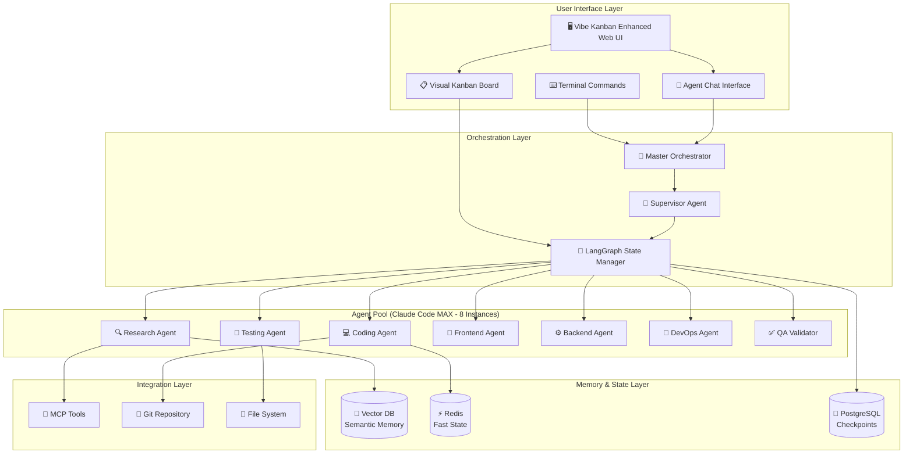
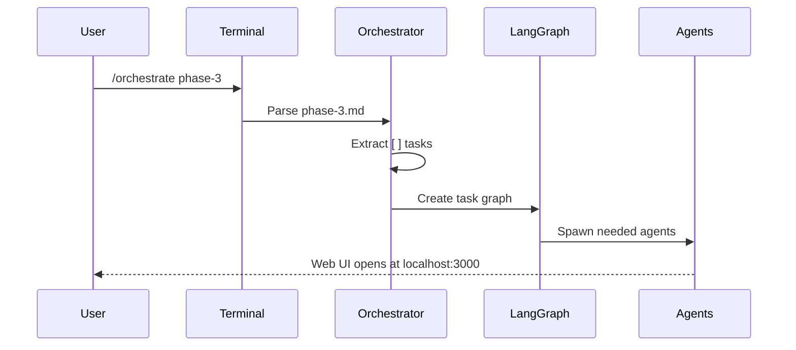
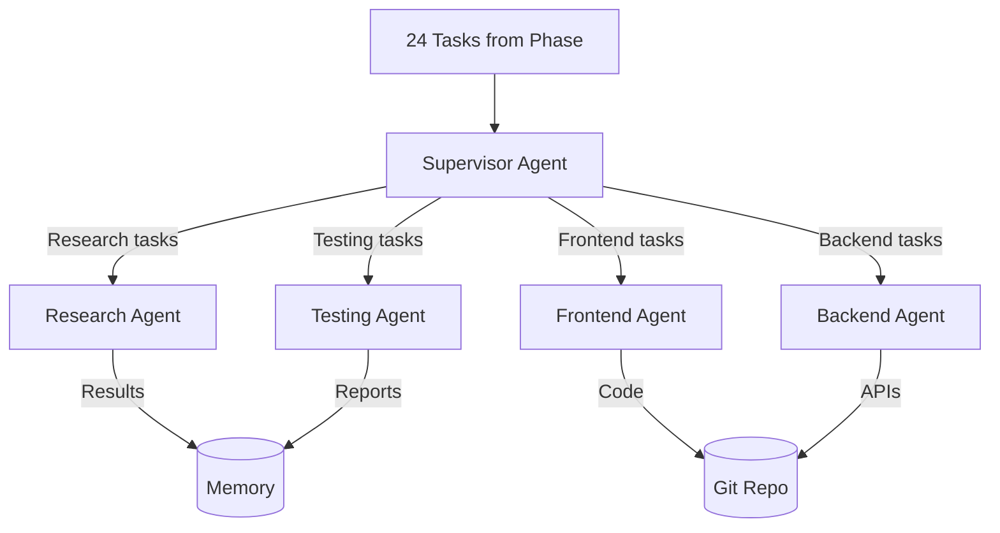
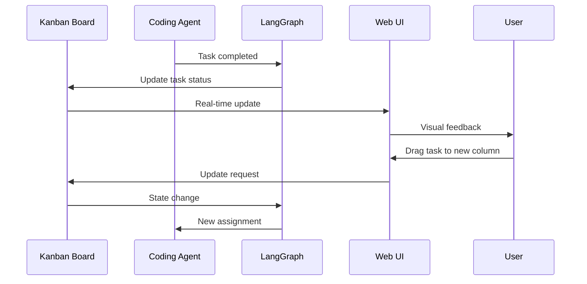

# Phase 8: Vibe Kanban Multi-Agent System - Visual Overview

## System Architecture Diagram



## User Experience Flow

### 1. Starting a Project


### 2. Kanban Board View
```
┌─────────────────────────────────────────────────────────────────────────┐
│  Vibe Kanban Multi-Agent System                    👤 Claude MAX Connected│
├─────────────────────────────────────────────────────────────────────────┤
│                                                                           │
│  ┌─────────────┬─────────────┬─────────────┬─────────────┬────────────┐│
│  │   BACKLOG   │    TODO     │ IN PROGRESS │   REVIEW    │    DONE    ││
│  │             │             │             │             │            ││
│  │ ┌─────────┐ │ ┌─────────┐ │ ┌─────────┐ │ ┌─────────┐ │ ┌────────┐││
│  │ │📝 Task 1│ │ │📝 Task 3│ │ │📝 Task 5│ │ │📝 Task 7│ │ │✅Task 9│││
│  │ │Research │ │ │Frontend │ │ │Backend  │ │ │Testing  │ │ │Complete│││
│  │ │/ultrathnk│ │ │Component│ │ │API endpt│ │ │95% covg │ │ │        │││
│  │ └─────────┘ │ └─────────┘ │ └─────────┘ │ └─────────┘ │ └────────┘││
│  │             │             │ 🤖Coding    │ 🤖Testing   │            ││
│  │ ┌─────────┐ │ ┌─────────┐ │ ┌─────────┐ │             │ ┌────────┐││
│  │ │📝 Task 2│ │ │📝 Task 4│ │ │📝 Task 6│ │             │ │✅Task10│││
│  │ │Database │ │ │UI Design│ │ │Auth logic│ │             │ │Complete│││
│  │ │Schema   │ │ │Shadcn/UI│ │ │/implement│ │             │ │        │││
│  │ └─────────┘ │ └─────────┘ │ └─────────┘ │             │ └────────┘││
│  │             │ 🤖Frontend  │ 🤖Backend   │             │            ││
│  └─────────────┴─────────────┴─────────────┴─────────────┴────────────┘│
│                                                                           │
│  Active Agents: 🔍 Research (idle) | 💻 Coding (busy) | 🧪 Testing (busy)│
│                 🎨 Frontend (busy) | ⚙️ Backend (busy) | ✅ QA (idle)    │
└─────────────────────────────────────────────────────────────────────────┘
```

### 3. Agent Chat Interface
```
┌─────────────────────────────────────────────────────────────────────────┐
│  💬 Agent Communication                                          [−][□][×]│
├─────────────────────────────────────────────────────────────────────────┤
│ ┌─────────────────────────────────────────────────────────────────────┐ │
│ │ Orchestrator | Research | Coding | Testing | Frontend | Backend | All││ │
│ └─────────────────────────────────────────────────────────────────────┘ │
│                                                                           │
│  👔 Orchestrator                                              10:32 AM   │
│  ┌────────────────────────────────────────────────────────────────────┐ │
│  │ I've parsed phase-3.md and found 24 tasks. Assigning them now:     │ │
│  │ • 8 research tasks → Research Agent                                │ │
│  │ • 10 coding tasks → Coding & Backend Agents                        │ │
│  │ • 6 testing tasks → Testing Agent                                  │ │
│  └────────────────────────────────────────────────────────────────────┘ │
│                                                                           │
│  🔍 Research Agent                                            10:33 AM   │
│  ┌────────────────────────────────────────────────────────────────────┐ │
│  │ Starting task: "Research authentication best practices"            │ │
│  │ Using /ultrathink for deep analysis...                             │ │
│  │ [=====>          ] 35% complete                                    │ │
│  └────────────────────────────────────────────────────────────────────┘ │
│                                                                           │
│  💻 Coding Agent                                              10:34 AM   │
│  ┌────────────────────────────────────────────────────────────────────┐ │
│  │ Implementing user authentication module                             │ │
│  │ ```javascript                                                       │ │
│  │ export class AuthService {                                          │ │
│  │   async login(credentials) {                                        │ │
│  │     // JWT implementation...                                        │ │
│  │   }                                                                 │ │
│  │ }                                                                   │ │
│  │ ```                                                                 │ │
│  └────────────────────────────────────────────────────────────────────┘ │
│                                                                           │
│ ┌─────────────────────────────────────────────────────────────────────┐ │
│ │ Type a message... (@mention agents, use /commands)            [Send]│ │
│ └─────────────────────────────────────────────────────────────────────┘ │
└─────────────────────────────────────────────────────────────────────────┘
```

## How It Works - Step by Step

### Phase 1: Project Initialization
```mermaid
graph LR
    A[User runs<br/>/orchestrate phase-3] --> B[System reads<br/>phase-3.md]
    B --> C[Extract all<br/>[ ] checkboxes]
    C --> D[Analyze task<br/>types & deps]
    D --> E[Spawn needed<br/>agents]
    E --> F[Open web UI<br/>localhost:3000]
```

### Phase 2: Task Distribution


### Phase 3: Real-Time Collaboration


## Key Features Visualized

### 1. Auto-Detection & Connection
```
┌──────────────────────────┐     ┌──────────────────────────┐
│   ~/.claude/config.json  │────▶│  Claude Code MAX Account │
│   (Auto-detected)        │     │  8 Concurrent Instances  │
└──────────────────────────┘     └──────────────────────────┘
                │                              │
                └──────────────┬───────────────┘
                               ▼
                    ┌──────────────────────┐
                    │  Agent Instance Pool │
                    │  • Research Agent    │
                    │  • Coding Agent x2   │
                    │  • Testing Agent     │
                    │  • Frontend Agent    │
                    │  • Backend Agent     │
                    └──────────────────────┘
```

### 2. Memory System
```
┌─────────────────────────────────────────────────────────────┐
│                     Agent Memory System                      │
├─────────────────────────────────────────────────────────────┤
│                                                             │
│  Short-term Memory              Long-term Memory            │
│  ┌──────────────┐              ┌──────────────────┐        │
│  │    Redis     │              │   Vector DB      │        │
│  │              │              │                  │        │
│  │ • Task state │              │ • Code snippets  │        │
│  │ • Variables  │◀────────────▶│ • Decisions      │        │
│  │ • Recent ctx │              │ • Patterns       │        │
│  └──────────────┘              └──────────────────┘        │
│         ▲                              ▲                    │
│         └──────────────┬───────────────┘                   │
│                        │                                    │
│                   Agent Queries                             │
│                "What did I implement?"                      │
│                "Previous test results?"                     │
└─────────────────────────────────────────────────────────────┘
```

### 3. Collaboration Modes

#### Single Branch Mode (Default)
```
            Main Branch
                │
                ▼
    ┌───────────────────────┐
    │   All Agents Work Here │
    │                       │
    │  🔍 Research ──┐      │
    │  💻 Coding ────┼──▶ File Locking │
    │  🧪 Testing ───┘   & Queueing    │
    │                                  │
    └───────────────────────────────────┘
```

#### Git Worktree Mode (Optional)
```
            Main Branch
                │
    ┌───────────┼───────────┬──────────┐
    ▼           ▼           ▼          ▼
 Research    Frontend    Backend    Testing
 Worktree    Worktree   Worktree   Worktree
    │           │           │          │
    └───────────┴───────────┴──────────┘
                    │
                    ▼
               Auto-merge
```

## User Interaction Examples

### Example 1: Natural Language Task Assignment
```
User: "We need to add user authentication to the app"
Orchestrator: "I'll create tasks for this. Breaking it down:
  • Research best practices (Research Agent)
  • Design auth schema (Backend Agent)
  • Implement JWT logic (Coding Agent)
  • Create login UI (Frontend Agent)
  • Write auth tests (Testing Agent)"
```

### Example 2: Status Monitoring
```
User: "How's the authentication feature coming along?"
Orchestrator: "Current status:
  ✅ Research Agent: Completed auth best practices analysis
  🔄 Backend Agent: 70% done with database schema
  🔄 Coding Agent: Implementing JWT middleware (40%)
  ⏳ Frontend Agent: Waiting for API endpoints
  ⏳ Testing Agent: Ready to start once implementation is done"
```

### Example 3: Direct Agent Communication
```
User: "@research-agent what authentication method do you recommend?"
Research Agent: "Based on my analysis using /ultrathink:
  • JWT for stateless auth (recommended)
  • Session-based for simpler apps
  • OAuth2 for third-party integration
  Given your requirements, JWT with refresh tokens is optimal."
```

## Benefits of This System

### 1. Zero Manual Task Creation
- Automatically extracts tasks from phase markdown files
- No need to manually create kanban cards

### 2. Intelligent Task Distribution
- Supervisor analyzes each task
- Assigns to most suitable agent
- Balances workload automatically

### 3. Real-Time Visibility
- See what every agent is doing
- Track progress visually
- Chat with agents directly

### 4. Memory Persistence
- Agents remember previous work
- Context carries between tasks
- No repeated explanations needed

### 5. Parallel Execution
- Multiple agents work simultaneously
- No bottlenecks from sequential work
- Faster project completion

### 6. Quality Assurance
- QA Validator checks all work
- Automated testing at each step
- 95%+ code coverage enforced