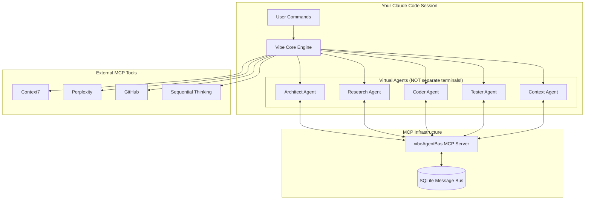

# Claude Vibe 🚀

Transform your development process with AI-powered slash commands that implement the complete Vibe Coding methodology in Claude. Now with **Phase 3 Advanced Context Features** including Pattern Recognition & Processing (PRP) System, Field Protocols, and **Enhanced Multi-Agent System** with MCP-native architecture that creates virtual agents within your single Claude Code session!

## 🎯 What is this?

A comprehensive system of slash commands for Claude that includes:

1. **Full Vibe Coding Methodology** - Automates all 10 steps from ideation to production
2. **Phase 3 Advanced Context Features** - PRP System, Field Protocols, Token Budget Management
3. **Enhanced Multi-Agent System** - Virtual agents within ONE Claude session coordinating through MCP server
4. **YAML-Based Agent System** - Feature-level development, retrofitting, and dynamic agent generation
5. **Service Auto-Connection** - Automatically connects databases, APIs, and monitoring tools
6. **Context Engineering Infrastructure** - Advanced context management and optimization
7. **Claude.md Agent Configuration** - Transforms Claude into a specialized project assistant

This unified system works with both new projects AND existing codebases, providing multiple entry points for different development scenarios.

## 🆕 NEW: Enhanced Multi-Agent System with Virtual Agents

**Revolutionary MCP-Native Architecture:**
- **🎯 Virtual Agents**: Specialized AI roles within your single Claude session (NOT multiple terminals!)
- **📡 MCP Message Bus**: Persistent SQLite-based communication replacing unreliable file watching
- **🧠 UltraThink with Diagrams**: Now generates Mermaid architecture diagrams automatically
- **💾 Agent Memory**: Persistent context across sessions for continuous development
- **⚡ 99%+ Reliability**: Compared to ~60% with old file-based systems

**Phase 3 Context Engineering Features:**
- **🧠 PRP System**: Pattern Recognition & Processing for intelligent code analysis
- **📋 Field Protocols**: Advanced context management and optimization
- **⚡ Token Budget Management**: Efficient context usage and memory optimization
- **🔄 Integration Adapter**: Seamless integration with existing codebases

### Revolutionary Features
- **🚀 Zero Manual Prompting**: Give one command, agents work automatically
- **🧠 Intelligent Task Breakdown**: Orchestrator analyzes and assigns tasks intelligently  
- **⚡ Real-time Coordination**: Agents communicate and coordinate seamlessly
- **🔄 Automatic Execution**: UltraThink, implementation, testing happen automatically
- **📊 Progress Tracking**: Real-time status updates and completion notifications
- **🎯 Context-Aware Processing**: Phase 3 features enhance agent intelligence and efficiency

### Quick Demo - Single Claude Session
```bash
# Initialize enhanced multi-agent system (one-time)
/vibe-multi-agent-enhanced

# Use intelligent coordination with virtual agents:
/coordinateUltraThink taskDescription="implement user authentication system"

# What happens (all in your single Claude session):
# → Architect Agent: Creates system diagrams with Mermaid
# → Research Agent: Analyzes best practices via Context7/Perplexity
# → Coder Agent: Plans implementation approach
# → Tester Agent: Designs testing strategy
# → Context Agent: Ensures pattern compliance
# → All coordinate through persistent MCP message bus!

# Or use the simple orchestrator:
/orchestrate
> task implement user authentication system
# Virtual agents coordinate automatically within your session
```

## ✨ Features

- **Automated Workflow**: Progress through all 10 Vibe Coding steps with simple slash commands
- **Advanced Context Engineering**: Advanced PRP System, Field Protocols, and Token Budget Management
- **Multi-Agent Collaboration**: Run specialized AI agents in parallel for faster development
- **UI Healing System**: 🔥 **NEW** Comprehensive UI testing, browser testing, visual regression, accessibility testing, and automatic healing
- **Repository Cleanup**: 🔥 **NEW** 4-agent cleanup system for maintaining codebase health and optimization
- **Context-Aware Intelligence**: Enhanced agent coordination through advanced context management
- **MCP Integration**: Leverages Context7, Perplexity, and other MCP tools for research
- **Context Preservation**: Each step builds on previous outputs automatically with Advanced Context optimization
- **Real-time Coordination**: Agents communicate through channel.md for seamless collaboration
- **Project Management**: Automatic file creation and organization with context tracking
- **Enhanced Quality Assurance**: Built-in 95% test coverage requirements with intelligent validation and UI healing
- **Service Auto-Init**: Automatically connect to databases, APIs, and monitoring tools
- **Claude.md Generation**: Create comprehensive AI assistant configurations
- **Retrofit Capabilities**: Transform existing codebases with Advanced Context engineering
- **Performance Optimization**: Memory-efficient context processing and token budget management
- **Legacy Enhancement**: 🔥 **NEW** Transform existing phases to new enhanced format with integrated capabilities

## 🏗️ System Architecture

### Enhanced Multi-Agent System (Single Claude Session)



### Key Architecture Points

- **Single Claude Instance**: All agents are virtual roles within ONE Claude session
- **MCP Message Bus**: Persistent SQLite database for reliable communication
- **No File Watching**: Replaced error-prone file-based system with MCP server
- **Agent Memory**: Each virtual agent maintains context across sessions
- **99%+ Reliability**: Compared to ~60% with old multi-terminal approach

## 🚀 Quick Start

### Installation

1. Clone this repository:
   ```bash
   git clone https://github.com/Dallionking/claude-vibe.git
   cd claude-vibe
   ```

2. Install dependencies (required for Phase 3 and multi-agent features):
   ```bash
   npm install
   ```
   **Phase 3 Dependencies**: TypeScript 5.2+, chokidar, js-yaml, chalk, ws, glob, uuid

3. In Claude Desktop, go to Settings → Developer
4. Enable "Developer mode" if not already enabled
5. Import `claude.json` into your Claude configuration
6. Verify installation:
   ```bash
   npm run doctor
   ```

### Basic Usage

Start a new project:
```
/vibe-init my-awesome-saas
/vibe-step-1-ideation
```

### Enhanced Multi-Agent Usage (Virtual Agents in Single Session!)

#### Option 1: MCP-Native Setup (Recommended) 🆕
```bash
# Initialize enhanced multi-agent system (one-time setup)
cd multi-agent
./install.sh

# In your Claude session:
/vibe-multi-agent-enhanced

# That's it! Now use intelligent coordination:
/coordinateUltraThink taskDescription="implement user dashboard"
```

**🎯 Key Clarification**: All agents are **virtual roles** within your single Claude session - NOT separate terminals!

**🆕 Enhanced UltraThink with Mermaid Diagrams:**
- **5-Agent Coordination**: Architect (now generates diagrams!), Research, Coder, Tester, Context
- **Automatic Architecture Diagrams**: Visual system design with Mermaid
- **Persistent Agent Memory**: Agents remember context across sessions
- **MCP Message Bus**: 99%+ reliable communication vs old file-based system

#### Option 2: Legacy Multi-Terminal Setup (Still Supported)
```bash
# If you prefer the old multi-terminal approach:
/multi-agent
/orchestrate

# Give commands like:
task implement authentication system
task optimize database queries
workflow feature-development
```

## 📋 Complete Command Reference

### Core Vibe Coding Commands

| Step | Command | Description | MCP Tools Used |
|------|---------|-------------|----------------|
| Init | `/vibe-init [project-name]` | Initialize a new Vibe Coding project | GitHub |
| 1 | `/vibe-step-1-ideation` | Project ideation and specification | Context7, Perplexity |
| 2 | `/vibe-step-2-architecture` | Technical architecture planning | Context7, Perplexity |
| 3 | `/vibe-step-3-ux-design` | UX/UI design specifications | Perplexity |
| 4 | `/vibe-step-4-design-system` | Design system creation | - |
| 5 | `/vibe-step-5-interface-states` | Interface state specifications | - |
| 6 | `/vibe-step-6-technical-spec` | Technical specification | Context7 |
| 7 | `/vibe-step-7-landing-page` | Landing page creation (3 parts) | Perplexity |
| 8 | `/vibe-step-8-vertical-slices` | Development phase slicing | Context7, TaskMaster |
| 9 | `/vibe-step-9-claude-md` | Generate Claude.md configuration | Sequential Thinking |
| 10 | `/vibe-step-10-init-services` | Auto-initialize all services | All project MCPs |
| - | `/vibe-status` | Check project progress | - |
| - | `/vibe-init-services` | Quick access to service init | All project MCPs |

### Multi-Agent Commands

| Command | Description | Features |
|---------|-------------|----------|
| `/vibe-multi-agent-enhanced` 🆕 | Initialize enhanced MCP-native system | Single session, virtual agents, persistent memory |
| `/coordinateUltraThink` 🆕 | 5-agent intelligent coordination | Auto-generates architecture diagrams with Mermaid |
| `/sendVibeMessage` 🆕 | Send messages via MCP bus | Persistent, reliable communication |
| `/multi-agent` | Legacy multi-terminal system | Still supported but not recommended |
| `/orchestrate` | Start orchestrator | Works with both new and legacy systems |
| `/re-channel [agent] [time]` | Comprehensive QA validation | Validates all claimed work |

#### Virtual Agent Roles (All in Single Session):
- **Architect Agent**: System design, generates Mermaid diagrams 🆕
- **Research Agent**: Uses Context7/Perplexity for best practices
- **Coder Agent**: Implementation planning and code structure  
- **Tester Agent**: Validates code, ensures 95%+ coverage
- **Context Agent**: Pattern analysis and consistency

#### Orchestrator Commands (Zero Manual Intervention):
```bash
# In orchestrator terminal - agents work automatically:
task [description]           # Intelligent task breakdown and assignment
workflow [name]             # Execute multi-agent workflows  
status                      # Show all agent status and progress
help                        # Show available commands
```

#### QA Validation Commands:
```bash
# Comprehensive quality assurance:
/re-channel                 # Validate all recent agent work
/re-channel coding-agent    # Validate specific agent's work
/re-channel all last-1h     # Validate last hour's work
/re-channel all last-7d     # Validate last week's work
```

**Key Features of `/re-channel`:**
- 🔍 **Validates All Claims**: Checks every completion claim in channel.md
- 📁 **File Verification**: Ensures all mentioned files exist and contain real code
- 🔗 **Integration Testing**: Validates file relationships and dependencies
- 🧪 **Functional Verification**: Tests that claimed features actually work
- 📊 **Gap Analysis**: Identifies missing implementations and half-completed work
- 🎯 **Actionable Reports**: Provides specific fix recommendations
- ⚡ **Automatic QA**: Catches the "half-implemented" problem automatically

### YOLO Commands (Zero-Friction Phase Execution) 🚀

**NEW**: Execute complete phases with zero permission prompts while maintaining full quality!

| Command | Description | Features |
|---------|-------------|----------|
| `/yolo local [options]` | Execute phases locally with full automation | Zero prompts, full quality, dynamic phase support |
| `/yolo docker [options]` | Execute phases in Docker container | Clean environment, reproducible, auto-installation |

#### Common Options:
```bash
--phase=N                    # Execute specific phase (default: current)
--tier=N                     # Execute specific tier only (1, 2, or 3)
--verbose                    # Show detailed command execution
--dry-run                    # Preview what would be executed
```

#### Docker-specific Options:
```bash
--rebuild                    # Force rebuild of Docker image
--no-cache                   # Build Docker image without cache
--keep-container             # Keep container after execution
```

#### Safety Options:
```bash
--emergency-stop             # Create periodic checkpoints
--interval=N                 # Checkpoint interval in minutes (default: 5)
```

#### YOLO Examples:
```bash
# Execute current phase locally
/yolo local

# Execute specific phase with verbose output
/yolo local --phase=2 --verbose

# Execute in Docker container
/yolo docker --phase=1 --rebuild

# Preview execution plan
/yolo docker --dry-run

# Execute single tier only
/yolo local --tier=1 --verbose
```

## 🤖 Multi-Agent System Guide

### How It Works

1. **Orchestrator (Terminal 1)**: Your command center - you interact here
2. **Worker Agents (Other Terminals)**: Specialized agents that execute tasks
3. **channel.md**: Communication hub where agents coordinate
4. **Automatic Coordination**: Agents work together based on their specialties

### Example Multi-Agent Workflow

```bash
# Terminal 1 (You talk here)
orchestrator> task implement user authentication

# The system automatically:
# - Assigns research to research-agent
# - Coordinates implementation across coding agents
# - Runs tests with testing-agent
# - All visible in channel.md!
```

### Agent Types

- **Research Agent**: Gathers information and best practices
- **Coding Agents**: Implement features (frontend/backend)
- **Testing Agent**: Writes and runs tests
- **Documentation Agent**: Creates documentation
- **Specialized Agents**: Custom agents for your project needs

## 🔄 Additional YAML-Based Commands

The system now includes powerful YAML-based agents for specific scenarios:

### Feature-Level Development
| Command | Description | Use Case |
|---------|-------------|----------|
| `/vibe-feature-ideate` | Add features to existing projects | When you need to add a feature without full project rebuild |
| `--quick` | Skip research steps | For simple, well-understood features |
| `--skip-research` | Skip external research | When you have all requirements defined |

### Codebase Retrofitting
| Command | Description | Use Case |
|---------|-------------|----------|
| `/vibe-retrofit-existing` | Transform chaotic codebases | When inheriting messy projects |
| `--mode full` | Complete analysis and transformation | For comprehensive retrofitting |
| `--generate-agents` | Create custom agents for the codebase | For unique project patterns |

### Dynamic Agent Generation
| Command | Description | Use Case |
|---------|-------------|----------|
| `/vibe-generate-agents` | Create custom agents from patterns | When standard agents don't fit |
| `--analyze-codebase` | Learn from existing code | To match current patterns |
| `--workflow-type` | Specify agent purpose | For targeted agent creation |

## 🔧 Requirements

### Core Requirements
- **Claude Desktop App** (latest version)
- **Node.js** v18+ (for multi-agent system and Phase 3 features)
- **TypeScript** v5.2+ (for Phase 3 advanced context features)
- **Git** (for version control and project initialization)

### Phase 3 Context Engineering Requirements
- **Memory**: 4GB+ RAM recommended for context processing
- **Storage**: 1GB+ free space for context cache and processing
- **File System**: Read/write permissions for `.context-cache/` and `.workflow/` directories

### MCP Tools Configuration
- **Core Tools** (Recommended):
  - Context7 (documentation and library research)
  - Perplexity (market research and best practices)
  - GitHub (version control operations)
  - Sequential Thinking (complex multi-step planning)
- **Optional Tools** (Project-specific):
  - TaskMaster (advanced task management)
  - Supabase (if using Supabase backend)
  - Digital Ocean (if using DO infrastructure)
  - Slack (team notifications)
  - Linear (project management integration)
  - Shadcn UI (component generation)

## 📁 Complete Project Structure

### Generated Project Structure
```
your-project/
├── docs/
│   └── vibe-coding/
│       ├── 01-project-specification.md
│       ├── 02-technical-architecture.md
│       ├── 02-services-config.json      # Service configurations
│       ├── 03-ux-ui-design.md
│       ├── 04-design-system.md
│       ├── 05-interface-states.md
│       ├── 06-technical-specification.md
│       ├── 06-service-integrations.md    # Integration specs
│       ├── 07-landing-page/
│       │   ├── avatar-research.md
│       │   ├── emotional-diary.md
│       │   └── landing-page-copy.md
│       └── 08-phase-slices/
├── phases/
│   ├── phase-0-foundation.md
│   ├── phase-1-core.md
│   └── ...
├── .workflow/                             # Multi-agent workspace
│   ├── context/
│   │   ├── channel.md                     # Agent communication
│   │   ├── agents/                        # Agent contexts
│   │   └── shared/                        # Shared data
│   ├── definitions/                       # Workflow definitions
│   └── agent-setup.md                     # Setup instructions
├── .vibe/
│   ├── services.json                      # Service configuration
│   ├── init-services.log                  # Initialization logs
│   └── status.json
├── .taskmaster/
├── .claude/                               # Agent configuration files
│   ├── patterns.json
│   ├── shortcuts.yaml
│   └── behaviors.yaml
├── CLAUDE.md                              # AI Agent configuration
├── .env.local
└── [your source code]
```

### Vibe-Coding-Claude System Structure
```
vibe-coding-claude/
├── agents/
│   ├── core/              # Core system agents
│   ├── step-*/            # Step-specific agents (MD format)
│   ├── retrofit/          # Retrofit agents (MD format)
│   ├── yaml-based/        # YAML-based agents
│   └── generated/         # Auto-generated agents
├── multi-agent/           # NEW: Multi-agent system
│   ├── core/              # Core infrastructure
│   ├── agents/            # Agent definitions
│   ├── workflows/         # Workflow templates
│   └── examples/          # Example implementations
├── templates/
├── validation/
├── mcps/
├── phase-projects/
└── scripts/
```

## 🎓 Learning Path

1. **Start Simple**: Use `/vibe-init` and follow the step commands
2. **Try Multi-Agent**: Run `/multi-agent` for parallel development
3. **Explore Features**: Try feature ideation on existing projects
4. **Advanced Usage**: Create custom agents and workflows

## 📚 Documentation

### Core Documentation
- **[COMMANDS-CHEATSHEET.md](./COMMANDS-CHEATSHEET.md)** - Complete reference for all 105+ commands
- **[INSTALLATION.md](./INSTALLATION.md)** - Comprehensive installation guide with Phase 3 setup
- **[QUICK-START.md](./docs/QUICK-START.md)** - Get started in 5 minutes (coming soon)
- **[TROUBLESHOOTING.md](./TROUBLESHOOTING.md)** - Common issues and solutions (coming soon)

### Advanced Features
- **[Multi-Agent Guide](./multi-agent/README.md)** - Detailed multi-agent documentation
- **[How It Works](./multi-agent/README-how-it-works.md)** - Simple explanation of multi-agent system
- **[Phase 3 Context Engineering](./phase-3-advanced-context/README.md)** - Advanced context features
- **[Context Engineering Status](./CONTEXT-ENGINEERING-STATUS.md)** - Current implementation status

### Project Information
- **[Current Status](./current_status.md)** - Latest project development status
- **[Changelog](./changelog.md)** - Version history and updates
- **[Features](./features.md)** - Complete feature overview

## 🔥 Examples

### Simple Project
```bash
/vibe-init todo-app
/vibe-step-1-ideation
# Follow prompts...
```

### Multi-Agent Development (Enhanced MCP Version)
```bash
# One-time setup
cd multi-agent && ./install.sh

# In Claude:
/vibe-multi-agent-enhanced
/coordinateUltraThink taskDescription="implement user dashboard"
# Virtual agents collaborate within your session!
```

### Add Feature to Existing Project
```bash
cd existing-project
/vibe-feature-ideate "Add real-time notifications"
```

### Retrofit Messy Codebase
```bash
cd legacy-project
/vibe-retrofit-existing --mode full
```

## 💡 Tips

1. **Use MCP Tools**: The more MCP tools you have configured, the better the results
2. **Follow Order**: Complete steps in sequence for best results
3. **Try Multi-Agent**: For complex features, multi-agent is much faster
4. **Leverage Phase 3**: Use context engineering features for better code analysis
5. **Review Outputs**: Each step generates detailed documentation
6. **Monitor Context**: Use `/context-analyze` to optimize performance
7. **Use QA Commands**: Run `/re-channel` regularly to validate agent work
8. **Customize Agents**: Create agents specific to your project needs
9. **YOLO for Speed**: Use `/yolo` commands for maximum development velocity
10. **Validate Often**: Use `npm run doctor` to ensure system health

## 🤝 Contributing

We welcome contributions! Please see our contributing guidelines for more information.

## 📄 License

MIT License - see LICENSE file for details

## 🙏 Acknowledgments

Built on the Vibe Coding methodology, enhanced with Phase 3 Advanced Context Features, and powered by Claude's cutting-edge capabilities.

**Special thanks to the open-source community and all contributors who helped make Phase 3 Context Engineering possible.**

---

## 🚀 **Ready to revolutionize your development process?**

**Choose your path:**
- **🎯 Traditional Development**: `/vibe-init my-project`
- **🤖 Multi-Agent Team**: `/multi-agent`
- **⚡ Maximum Velocity**: `/yolo local`
- **🔧 Enhanced Existing Project**: `/vibe-retrofit-existing`
- **📋 Transform Legacy Phases**: `/vibe-reformat-phases` 🆕

**Phase 3 Context Engineering + Enhanced UltraThink + Multi-Agent Collaboration = The Future of AI Development!**

## 🆕 Latest Enhancements

### UltraThink 5-Agent Enhancement
- **Enhanced from 4 to 5 agents** with codebase intelligence
- **Architect Agent**: Now includes automatic codebase indexing and file relevance mapping
- **Context Agent**: New agent for pattern analysis and team convention extraction
- **Intelligent File Discovery**: Auto-identifies relevant files for any task
- **Pattern-Aware Code Generation**: 95%+ similarity to existing codebase patterns

### Phase Modernization
- **Step 8 Enhancement**: Now generates context-enhanced Universal Format phases
- **Legacy Phase Transformation**: Use `/vibe-reformat-phases` to upgrade existing phases
- **Pattern Compliance**: All generated code matches your existing patterns
- **Context-Aware Templates**: Enhanced templates with automatic pattern detection