# Vibe Coding Claude - Complete User Flow Diagram

## Overview
This document provides a comprehensive visual guide showing the complete user journey from discovering the Vibe Coding Claude system on GitHub to completing a full development project using the 10-step methodology.

---

## 🔍 **Phase 0: Discovery & Setup**

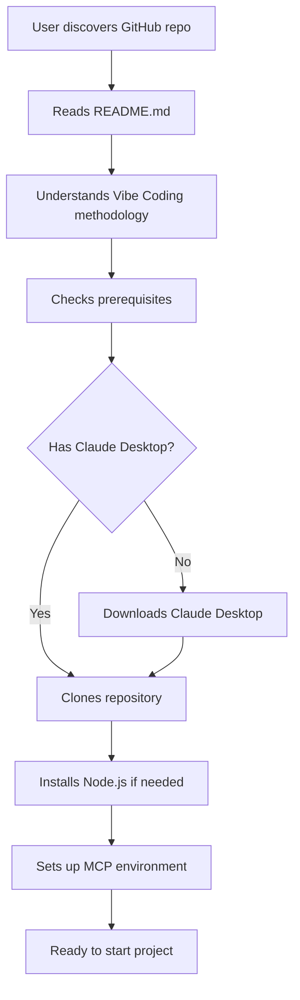

**User Actions:**
1. **Discovers Repository**: User finds vibe-coding-claude on GitHub
2. **Reads Documentation**: Reviews README.md and understands the 8+2 step methodology
3. **Checks Prerequisites**: Ensures Claude Desktop with MCP support is available
4. **Setup Environment**: Clones repo, installs dependencies, configures MCPs
5. **Validates Setup**: Confirms all tools are working correctly

**System State**: Repository cloned, environment configured, ready for project initialization

---

## 🚀 **Phase 1: Project Initialization**

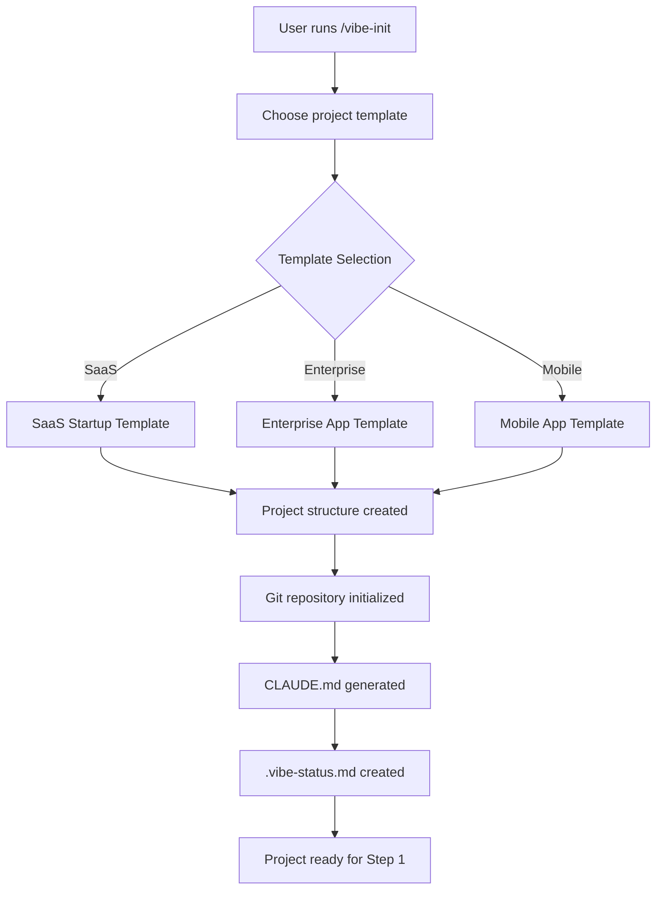

**User Actions:**
1. **Executes Init Command**: `/vibe-init my-awesome-project saas-startup`
2. **Reviews Generated Structure**: Examines created directories and files
3. **Reads CLAUDE.md**: Understands project-specific guidelines
4. **Checks Status**: Reviews `.vibe-status.md` for next steps

**System State**: 
- Project directory structure created
- Git repository initialized
- Basic configuration files in place
- Ready for ideation phase

**Files Created:**
```
my-awesome-project/
├── .vibe-status.md
├── CLAUDE.md
├── README.md
├── package.json
├── docs/
├── src/
├── tests/
└── .vibe/
    ├── current-status.json
    ├── features.json
    └── timeline.md
```

---

## 💡 **Step 1: Ideation & Specification**

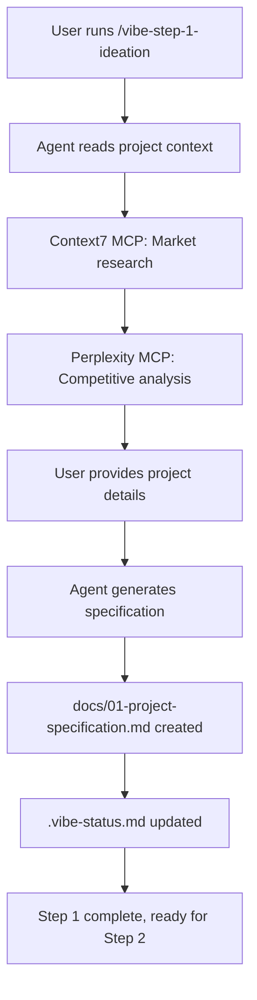

**User Actions:**
1. **Executes Command**: `/vibe-step-1-ideation`
2. **Provides Input**: Answers questions about project vision, target audience, core features
3. **Reviews Research**: Examines market research and competitive analysis
4. **Validates Specification**: Reviews generated project specification document
5. **Approves Output**: Confirms specification accuracy before proceeding

**MCP Tools Used:**
- **Context7**: Fetches relevant documentation and market data
- **Perplexity**: Conducts real-time market research and trend analysis

**System State**: 
- Comprehensive project specification documented
- Market research completed and documented
- User stories and feature priorities defined
- Business goals and success metrics established

**Output Files:**
- `docs/01-project-specification.md` (15-25 pages)
- `.vibe-status.md` updated with Step 1 completion

---

## 🏗️ **Step 2: Technical Architecture**

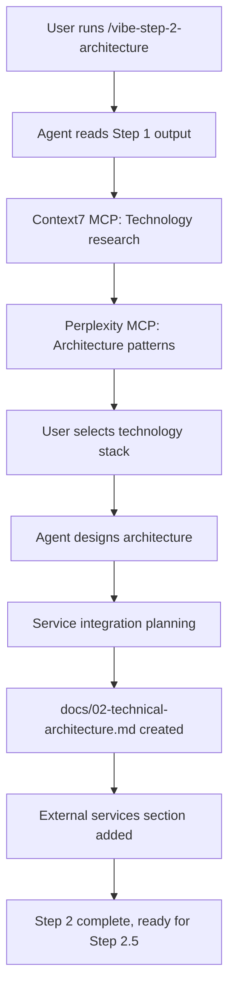

**User Actions:**
1. **Executes Command**: `/vibe-step-2-architecture`
2. **Reviews Technology Options**: Examines recommended tech stack options
3. **Makes Technology Decisions**: Selects frontend framework, backend technology, database, cloud provider
4. **Validates Architecture**: Reviews system architecture diagrams and component relationships
5. **Approves Services**: Confirms external service integrations (auth, payments, monitoring)

**Enhanced Features:**
- **External Services & Integrations Section**: 
  - Database services (Google Cloud SQL, Supabase, Digital Ocean)
  - Authentication providers (Auth0, Firebase, custom)
  - Monitoring solutions (DataDog, New Relic, Sentry)
  - Cloud platforms (AWS, GCP, Digital Ocean)
  - Payment processing (Stripe, PayPal)

**System State**:
- Complete technical architecture defined
- Technology stack selected and justified
- External service dependencies identified
- Database schema outline created
- API structure planned

**Output Files:**
- `docs/02-technical-architecture.md` (20-30 pages)
- System architecture diagrams
- Technology decision justifications

---

## 🔧 **Step 2.5: MCP Auto-Installation**

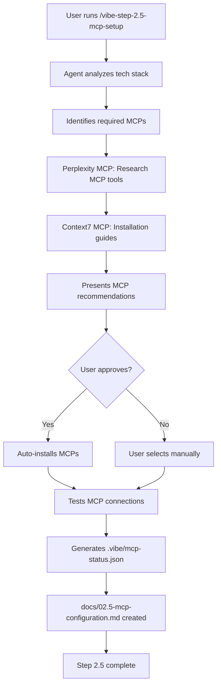

**User Actions:**
1. **Executes Command**: `/vibe-step-2.5-mcp-setup` or `/vibe-mcp-setup`
2. **Reviews Recommendations**: Examines suggested MCPs based on tech stack
3. **Approves Installation**: Confirms which MCPs to install automatically
4. **Provides API Keys**: Enters required API keys for MCP services
5. **Validates Connections**: Confirms all MCPs are working correctly

**MCP Installation Logic:**
- **React/Next.js projects** → Shadcn/UI MCP for component generation
- **Supabase backend** → Supabase MCP for database management
- **Digital Ocean hosting** → Digital Ocean MCP for infrastructure
- **Team size > 1** → Linear MCP for project management
- **Team collaboration** → Slack MCP for notifications

**System State**:
- All required MCPs installed and configured
- API keys securely stored in environment variables
- MCP health monitoring established
- Development tools optimized for project needs

**Output Files:**
- `.vibe/mcp-status.json` (MCP configuration and health)
- `docs/02.5-mcp-configuration.md` (Setup documentation)

---

## 🎨 **Step 3: UX Design**

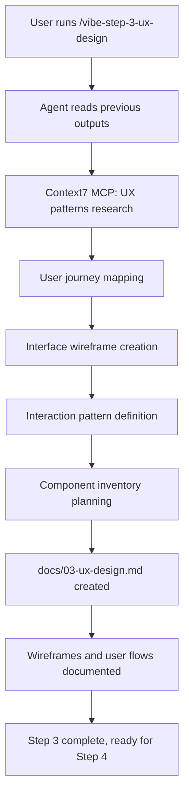

**User Actions:**
1. **Executes Command**: `/vibe-step-3-ux-design`
2. **Reviews User Journeys**: Examines mapped user flows and interaction patterns
3. **Validates Wireframes**: Reviews interface wireframes and layout suggestions
4. **Approves UX Patterns**: Confirms user experience decisions and navigation structure
5. **Plans Component Needs**: Reviews component inventory for design system

**System State**:
- Complete user experience design documented
- User journeys mapped with decision points
- Interface wireframes created for all major screens
- Component inventory planned for design system
- Interaction patterns defined

**Output Files:**
- `docs/03-ux-design.md` (25-35 pages)
- User journey diagrams
- Wireframe specifications
- Component planning documentation

---

## 🎯 **Step 4: Design System**

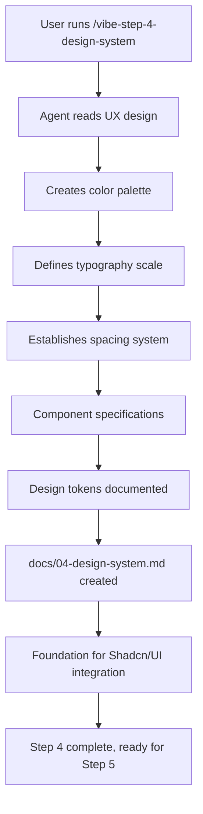

**User Actions:**
1. **Executes Command**: `/vibe-step-4-design-system`
2. **Reviews Color Palette**: Examines proposed brand colors and accessibility compliance
3. **Validates Typography**: Confirms font choices and size scales
4. **Approves Components**: Reviews component specifications and variants
5. **Confirms Design Tokens**: Validates the complete design system for implementation

**Design System Components:**
- **Color System**: Primary, secondary, accent colors with accessibility compliance
- **Typography Scale**: Font families, sizes, weights, line heights
- **Spacing System**: Consistent margin and padding values
- **Component Library**: Button, input, card, navigation specifications
- **Design Tokens**: Variables for Shadcn/UI and CSS implementation

**System State**:
- Complete design system documented
- Design tokens ready for Shadcn/UI integration
- Component specifications ready for implementation
- Brand identity established and consistent

**Output Files:**
- `docs/04-design-system.md` (20-30 pages)
- Design token specifications
- Component library documentation
- Brand guideline documentation

---

## 🔄 **Step 5: Interface States**

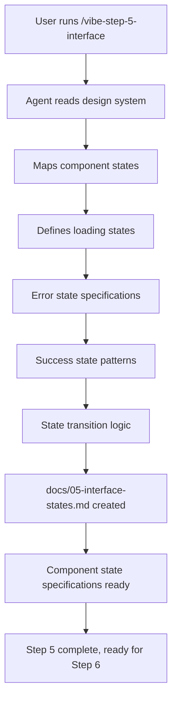

**User Actions:**
1. **Executes Command**: `/vibe-step-5-interface`
2. **Reviews State Specifications**: Examines all component states and transitions
3. **Validates User Feedback**: Confirms loading, error, and success state designs
4. **Approves State Logic**: Reviews state management and transition patterns
5. **Confirms Implementation**: Validates state specifications for development

**Interface State Categories:**
- **Component States**: Default, hover, active, disabled, loading
- **Application States**: Loading, error, empty, success
- **User Feedback**: Notifications, alerts, confirmations
- **Data States**: Loading, loaded, error, empty data sets
- **Form States**: Validation, submission, success, error handling

**System State**:
- All interface states comprehensively documented
- State management patterns established
- User feedback mechanisms defined
- Error handling strategies planned

**Output Files:**
- `docs/05-interface-states.md` (15-25 pages)
- State management specifications
- User feedback pattern documentation

---

## 📋 **Step 6: Technical Specification**

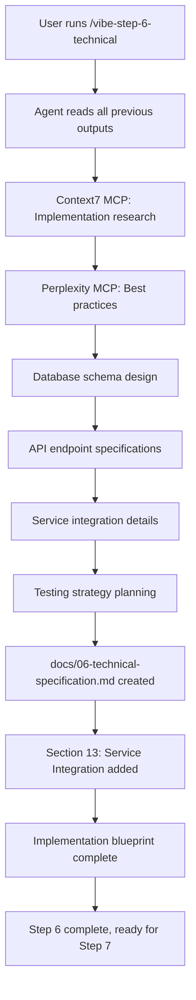

**User Actions:**
1. **Executes Command**: `/vibe-step-6-technical`
2. **Reviews Database Schema**: Examines table structures, relationships, and indexes
3. **Validates API Design**: Confirms endpoint specifications and data models
4. **Approves Service Integration**: Reviews external service configuration details
5. **Confirms Testing Strategy**: Validates comprehensive testing approach

**Enhanced Features:**
- **Section 13: Service Integration Specifications**:
  - Database connection configurations
  - Authentication flow implementations
  - Environment variable management
  - API integration patterns
  - Error handling and fallback strategies

**System State**:
- Complete implementation blueprint created
- Database schema ready for migration creation
- API specifications ready for development
- Service integration patterns defined
- Testing strategy comprehensive and actionable

**Output Files:**
- `docs/06-technical-specification.md` (40-60 pages)
- Database schema diagrams
- API documentation
- Service integration specifications

---

## 🎭 **Step 7: Landing Page Creation**

```mermaid
graph TD
    A[User runs /vibe-step-7-landing] --> B[Three-part process]
    B --> C[/vibe-landing-avatar]
    C --> D[Context7 & Perplexity MCP research]
    D --> E[Customer avatar analysis]
    E --> F[/vibe-landing-diary]
    F --> G[Emotional diary creation]
    G --> H[/vibe-landing-copy]
    H --> I[Landing page copy generation]
    I --> J[docs/07-landing-page/ created]
    J --> K[Marketing materials complete]
    K --> L[Step 7 complete, ready for Step 8]
```

**User Actions:**
1. **Executes Avatar Research**: `/vibe-landing-avatar`
   - Reviews 5 awareness stages of customer avatars
   - Validates target audience analysis
   - Confirms customer pain points and motivations

2. **Creates Emotional Diaries**: `/vibe-landing-diary`
   - Reviews emotional journey mapping
   - Validates customer emotional states
   - Confirms messaging alignment with user feelings

3. **Generates Landing Copy**: `/vibe-landing-copy`
   - Reviews high-converting copy variations
   - Validates messaging and call-to-actions
   - Confirms brand voice and positioning

**System State**:
- Customer avatars comprehensively researched and documented
- Emotional journey mapped for effective messaging
- High-converting landing page copy generated
- Marketing foundation established for product launch

**Output Files:**
- `docs/07-landing-page/customer-avatars.md`
- `docs/07-landing-page/emotional-diary.md`
- `docs/07-landing-page/landing-page.md`

---

## 🧩 **Step 8: Feature-Driven Universal Format Vertical Slices**

```mermaid
graph TD
    A[User runs /vibe-step-8-slices] --> B[PART 1: Feature Analysis Engine]
    B --> C[Read docs/06-technical-specification.md Section 3]
    C --> D[Extract Section 3.1 Feature Implementation Priority Matrix]
    D --> E[Identify ALL Section 3.X Feature Specifications]
    E --> F[Map features to Implementation Phase 1/2/3 and Priority High/Medium/Low]
    F --> G[Count total features = N]
    G --> H[Dynamic Phase Planning: Phase 0 + N feature phases]
    H --> I[PART 2: Universal Format Generation]
    I --> J{Foundation needed?}
    J -->|Yes| K[Generate Phase 0: Foundation & Authentication]
    J -->|No| L[Start with feature phases]
    K --> L
    L --> M[Generate Phase 1: Section 3.2 Feature Name]
    M --> N[Generate Phase 2: Section 3.3 Feature Name]
    N --> O[Generate Phase 3: Section 3.4 Feature Name]
    O --> P[Continue for ALL N features]
    P --> Q[Each phase = Complete vertical slice for ONE feature]
    Q --> R[phases/phase-{N}-{actual-feature-name}.md created]
    R --> S[Feature-specific implementation from DB → API → UI → Testing]
    S --> T[Ready for feature-by-feature development]
```

**User Actions:**
1. **Executes Command**: `/vibe-step-8-slices`
2. **Reviews Feature Analysis**: Confirms agent found all Section 3.X features
3. **Validates Priority Matrix**: Examines Phase 1/2/3 and High/Medium/Low mappings
4. **Checks Dynamic Phase Count**: Verifies phase count matches feature count (8 features = 8 phases)
5. **Reviews Feature-Specific Phases**: Each phase implements ONE complete feature
6. **Approves Implementation Strategy**: Confirms feature-driven development approach

**What Step 8 Actually Does (UPDATED):**
- **Analyzes Feature Implementation Priority Matrix** from Section 3.1
- **Extracts every Section 3.X feature specification** (not generic features)
- **Creates ONE phase per feature** (dynamic phase count based on actual features)
- **Maps each feature to its technical requirements** from Section 3.X subsections
- **Generates feature-specific Universal Format phases** with complete vertical slice
- **Ensures each phase references design system** for UI component generation

**Universal Format Features (Feature-Driven):**
- **Feature Implementation Priority Matrix Integration**: Reads Section 3.1 for phase planning
- **Dynamic Phase Count**: Phase count = Feature count from specifications  
- **Mandatory State File Reading**: Agent reads all `.vibe/` context files
- **Feature-Specific Tiered Structure**: Tier 1 (Feature Infrastructure), Tier 2 (Feature Implementation), Tier 3 (Feature Polish)
- **Git Workflow**: Feature-specific branch creation with regular checkpoints
- **MCP Tool Integration**: Research and component generation for each specific feature
- **Design System Integration**: Shadcn/UI component generation using docs/04-design-system.md
- **Quality Checkpoints**: Validation between each tier for each feature
- **Project State Updates**: Files updated upon feature completion

**Example Feature-Specific Phase Structure:**
```markdown
# Phase 2. User Profile Management (from Section 3.2)

## Role & Background
Senior Full-Stack Engineer Profile: 10+ years experience in user management systems...

## Feature Description
User Profile Management allows users to create, edit, and manage their personal 
profiles including profile photos, bio information, and account preferences.
(Description derived from Section 3.2.1 Feature Overview)

⚠️ **IMPORTANT INSTRUCTIONS:**
**CRITICAL: Before starting, read these files:**
- current_status.md - Current project state
- known_issues.md - Technical debt  
- changelog.md - Change history
- features.md - Feature tracking

## Implementation Tasks:

### Tier 1 Task - User Profile Infrastructure Setup
#### Subtask 1.1: Git Branch Setup
- [ ] Create feature branch: feature/phase-2-user-profile-management
- [ ] Initial commit with empty commit

#### Subtask 1.2: User Profile Database Schema
- [ ] Use Context7 MCP for user management documentation
- [ ] Use Perplexity MCP for profile schema best practices
- [ ] Create user_profiles table with fields from Section 3.2.7
- [ ] Set up profile image storage configuration
- [ ] Configure privacy and visibility settings

### Tier 2 Task - Core User Profile Implementation  
#### Subtask 2.1: Profile Management System
- [ ] Use Shadcn/UI: "Generate profile edit form using design system from docs/04-design-system.md with fields for bio, profile photo upload, and preferences based on Section 3.2.2 user stories"
- [ ] Implement profile CRUD API endpoints from Section 3.2.6
- [ ] Create profile image upload and processing
- [ ] Add profile validation and sanitization

### Tier 3 Task - User Profile Polish & QA
#### Subtask 3.1: Profile Feature Testing & Validation
- [ ] 95%+ test coverage for all profile functionality
- [ ] End-to-end testing for complete profile management flow
- [ ] Performance optimization for profile image loading
- [ ] Integration testing with authentication system from Phase 0
```

**System State (Feature-Driven)**:
- **Feature Implementation Priority Matrix analyzed** from Section 3.1
- **ALL Section 3.X features mapped** to individual implementation phases  
- **Dynamic phase count** matching actual feature count from specifications
- **Feature-specific technical roadmap** with complete vertical slice per feature
- **Design system integration** with Shadcn/UI component generation per feature
- **Universal Format compliance** with feature-specific tier structure and quality gates
- **MCP tools strategically integrated** for feature-specific research and component generation
- **Quality standards enforced** with 95%+ test coverage requirements per feature

**Output Files (Feature-Driven):**
- `phases/phase-0-foundation.md` (if foundation needed)
- `phases/phase-1-{actual-feature-name}.md` (from Section 3.2)
- `phases/phase-2-{actual-feature-name}.md` (from Section 3.3)  
- `phases/phase-N-{actual-feature-name}.md` (continuing for all features)
- Updated `.vibe/` project state files with feature completion tracking

**Key Difference from Generic Phases:**
- Each phase = ONE complete feature implementation (DB → API → UI → Testing)
- Phase titles use actual feature names from technical specifications
- Phase count dynamically matches feature count (8 features = 8 phases, 20 features = 20 phases)
- No generic "implementation" or "enhancement" phases

---

## 🤖 **Step 9: Claude.md Generation**

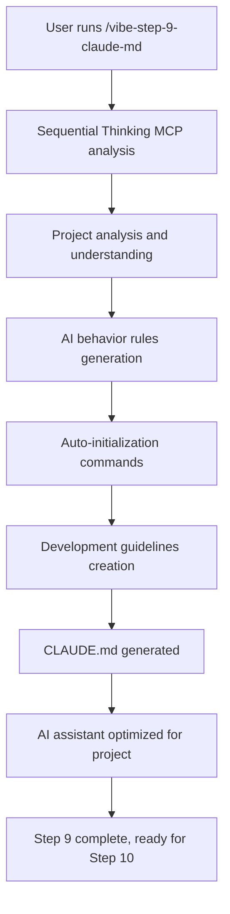

**User Actions:**
1. **Executes Command**: `/vibe-step-9-claude-md`
2. **Reviews AI Configuration**: Examines generated Claude.md behavior rules
3. **Validates Auto-Init Commands**: Confirms automatic initialization procedures
4. **Approves Development Guidelines**: Reviews AI assistant optimization for the project
5. **Confirms Integration**: Validates Claude.md enhances development workflow

**Claude.md Features:**
- **Project-Specific Rules**: AI behavior tailored to project requirements
- **Auto-Initialization**: Commands for setting up development environment
- **Quality Standards**: 95%+ test coverage and Universal Format compliance
- **MCP Integration**: Optimized usage of Context7, Perplexity, Shadcn/UI
- **Development Guidelines**: Best practices for the specific tech stack

**System State**:
- AI assistant optimized for project-specific development
- Automatic initialization procedures established
- Development workflow enhanced with AI guidance
- Quality standards enforced through AI configuration

**Output Files:**
- `CLAUDE.md` (10-15 pages of AI assistant configuration)

---

## 🚀 **Step 10: Service Auto-Initialization**

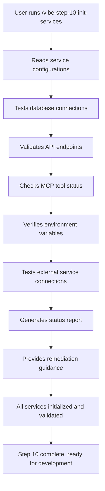

**User Actions:**
1. **Executes Command**: `/vibe-step-10-init-services` or `/vibe-init-services`
2. **Reviews Connection Tests**: Examines database and API connection results
3. **Validates Service Status**: Confirms all external services are properly configured
4. **Addresses Issues**: Follows remediation guidance for any failed connections
5. **Confirms Readiness**: Validates that all systems are ready for development

**Service Validation Categories:**
- **Database Connections**: PostgreSQL, MongoDB, Supabase
- **Authentication Services**: Auth0, Firebase, custom JWT
- **Cloud Services**: AWS, GCP, Digital Ocean
- **Payment Processing**: Stripe, PayPal integration testing
- **Monitoring Services**: DataDog, New Relic, Sentry
- **Communication**: Slack, email service validation
- **MCP Tools**: All configured MCPs health check

**System State**:
- All services tested and validated
- Development environment fully operational
- External dependencies confirmed working
- Ready for vertical slice implementation

**Output Report:**
```
✅ Service Initialization Complete

Database Connections:
✅ PostgreSQL: Connected (latency: 12ms)
✅ Supabase: Connected (auth working)

External Services:
✅ Stripe: API keys valid
✅ Auth0: Configuration verified
✅ Digital Ocean: Droplets accessible

MCP Tools:
✅ Context7: Connected and responding
✅ Perplexity: API quota available
✅ Shadcn/UI: Ready for component generation

Environment:
✅ All required variables set
✅ Security configurations validated
✅ Development mode active

🎉 System ready for development!
Next: Begin Phase 1 implementation
```

---

## 🛠️ **Development Phase: Implementation**

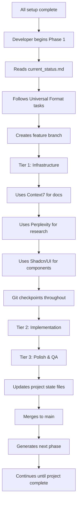

**Developer Workflow:**
1. **Reads Project State**: Reviews `.vibe/current_status.md` for context
2. **Follows Universal Format**: Uses generated phase documentation
3. **Leverages MCP Tools**: Uses Context7, Perplexity, Shadcn/UI throughout
4. **Maintains Quality**: Follows 95%+ test coverage requirements
5. **Updates Tracking**: Keeps project state files current
6. **Iterates Phases**: Continues through all features until completion

---

## 📊 **System Benefits Overview**

### For Individual Developers
- **Systematic Approach**: No more wondering what to build next
- **Quality Assurance**: 95%+ test coverage enforced
- **AI-Assisted Development**: MCP tools provide research and component generation
- **Professional Output**: Enterprise-ready code and documentation

### For Teams
- **Consistent Process**: Everyone follows the same methodology
- **Clear Documentation**: Comprehensive specs and progress tracking
- **Onboarding Efficiency**: New team members can quickly understand the system
- **Quality Standards**: Uniform code quality across all developers

### For Businesses
- **Predictable Delivery**: Systematic process reduces unknowns
- **Scalable Development**: Process works for projects of any size
- **Professional Results**: Enterprise-grade documentation and implementation
- **Risk Reduction**: Comprehensive planning reduces project failures

---

## 🎯 **Success Metrics**

By following this complete flow, users achieve:

1. **📋 Complete Project Documentation**: 200+ pages of comprehensive specifications
2. **🏗️ Production-Ready Architecture**: Scalable, maintainable system design
3. **🎨 Professional UI/UX**: Consistent design system with accessibility compliance
4. **⚡ Optimized Development**: MCP tools accelerate research and implementation
5. **🧪 Quality Assurance**: 95%+ test coverage with comprehensive validation
6. **📈 Business Success**: Market-validated features with high-converting landing pages

---

**The Vibe Coding Claude system transforms chaotic development into systematic, AI-enhanced productivity that delivers professional results every time! 🚀**