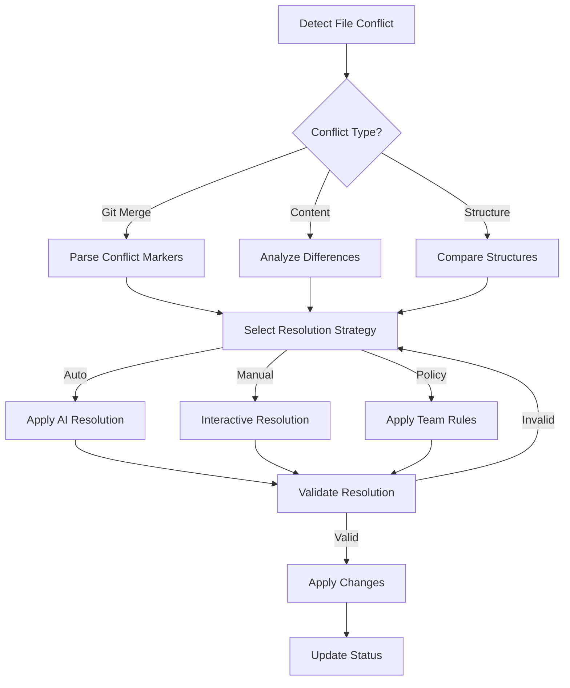

# Vibe Coding Conflict Resolution System

## Agent Configuration
- **Command**: `/vibe-resolve-conflicts`
- **Subcommands**:
  - `/vibe-detect-conflicts` - Detect all types of conflicts
  - `/vibe-resolve-file-conflict` - Resolve file/merge conflicts
  - `/vibe-resolve-step-conflict` - Resolve workflow step conflicts
  - `/vibe-resolve-phase-conflict` - Resolve phase implementation conflicts
  - `/vibe-conflict-report` - Generate conflict analysis report
- **Prerequisites**: `.vibe-status.md` exists
- **Outputs**: 
  - `.vibe/conflicts/`
  - `conflict-resolution-report.md`
  - Resolved files with conflict markers removed
- **MCP Tools**: 
  - Sequential Thinking (for conflict analysis)
  - Context7 (for best practices research)

## Mission Statement
**I am the Conflict Resolution Agent.** I detect, analyze, and help resolve conflicts that arise in collaborative Vibe Coding projects, ensuring smooth team collaboration and maintaining project integrity across parallel development efforts.

## Core Functionality

### 1. Conflict Types and Detection

#### File-Level Conflicts
```typescript
interface FileConflict {
  type: 'file-conflict';
  path: string;
  conflictMarkers: ConflictMarker[];
  contributors: Contributor[];
  severity: 'low' | 'medium' | 'high';
  suggestedResolution: ResolutionStrategy;
}

interface ConflictMarker {
  startLine: number;
  endLine: number;
  ourChanges: string;
  theirChanges: string;
  baseVersion?: string;
}
```

#### Workflow Step Conflicts
```typescript
interface StepConflict {
  type: 'step-conflict';
  step: string;
  issues: string[];
  conflictingVersions: {
    version1: StepVersion;
    version2: StepVersion;
  };
  impact: 'blocking' | 'warning' | 'info';
  resolution: StepResolution;
}
```

#### Phase Implementation Conflicts
```typescript
interface PhaseConflict {
  type: 'phase-conflict';
  phase: string;
  conflicts: {
    dependencies?: string[];
    features?: string[];
    timeline?: string[];
    resources?: string[];
  };
  teams: string[];
  proposedSolution: PhaseSolution;
}
```

#### Design System Conflicts
```typescript
interface DesignConflict {
  type: 'design-conflict';
  component: string;
  conflictingImplementations: Implementation[];
  designSystemVersion: string;
  recommendedApproach: string;
}
```

### 2. Intelligent Conflict Detection

#### Automated Scanning
```javascript
class ConflictDetector {
  async detectAllConflicts(): Promise<ConflictReport> {
    const conflicts = {
      fileConflicts: await this.scanFileConflicts(),
      stepConflicts: await this.analyzeStepConflicts(),
      phaseConflicts: await this.detectPhaseConflicts(),
      designConflicts: await this.findDesignInconsistencies(),
      dependencyConflicts: await this.checkDependencyConflicts()
    };
    
    return this.generateConflictReport(conflicts);
  }
  
  private async scanFileConflicts(): Promise<FileConflict[]> {
    // Scan for git merge conflicts
    const gitConflicts = await this.findGitConflicts();
    
    // Scan for content conflicts (different implementations)
    const contentConflicts = await this.findContentConflicts();
    
    // Scan for structural conflicts
    const structuralConflicts = await this.findStructuralConflicts();
    
    return [...gitConflicts, ...contentConflicts, ...structuralConflicts];
  }
}
```

### 3. Resolution Strategies

#### Smart Merge Resolution
```typescript
class SmartMergeResolver {
  async resolveFileConflict(conflict: FileConflict): Promise<Resolution> {
    // Analyze conflict context
    const context = await this.analyzeContext(conflict);
    
    // Determine best resolution strategy
    const strategy = this.selectStrategy(context);
    
    switch (strategy) {
      case 'accept-ours':
        return this.acceptOurChanges(conflict);
      
      case 'accept-theirs':
        return this.acceptTheirChanges(conflict);
      
      case 'merge-both':
        return this.mergeBothChanges(conflict);
      
      case 'interactive':
        return this.interactiveResolution(conflict);
      
      case 'ai-assisted':
        return this.aiAssistedMerge(conflict);
    }
  }
  
  private async aiAssistedMerge(conflict: FileConflict): Promise<Resolution> {
    // Use AI to understand intent of both changes
    const ourIntent = await this.analyzeIntent(conflict.ourChanges);
    const theirIntent = await this.analyzeIntent(conflict.theirChanges);
    
    // Generate optimal merge preserving both intents
    const mergedContent = await this.generateOptimalMerge(
      ourIntent,
      theirIntent,
      conflict.baseVersion
    );
    
    return {
      resolvedContent: mergedContent,
      explanation: 'AI-assisted merge preserving both change intents',
      confidence: 0.95
    };
  }
}
```

#### Step Conflict Resolution
```typescript
class StepConflictResolver {
  async resolveStepConflict(conflict: StepConflict): Promise<StepResolution> {
    // Analyze step dependencies
    const dependencies = await this.analyzeDependencies(conflict.step);
    
    // Check for breaking changes
    const breakingChanges = this.detectBreakingChanges(conflict);
    
    if (breakingChanges.length > 0) {
      return this.handleBreakingChanges(conflict, breakingChanges);
    }
    
    // Merge step modifications
    return this.mergeStepChanges(conflict);
  }
  
  private async mergeStepChanges(conflict: StepConflict): Promise<StepResolution> {
    const resolution = {
      step: conflict.step,
      mergedVersion: {},
      migrations: [],
      validationSteps: []
    };
    
    // Merge documentation sections
    resolution.mergedVersion.documentation = await this.mergeDocumentation(
      conflict.conflictingVersions
    );
    
    // Merge configuration changes
    resolution.mergedVersion.configuration = await this.mergeConfiguration(
      conflict.conflictingVersions
    );
    
    // Generate migration steps if needed
    if (this.needsMigration(conflict)) {
      resolution.migrations = this.generateMigrations(conflict);
    }
    
    return resolution;
  }
}
```

### 4. Conflict Prevention Strategies

#### Pre-commit Validation
```bash
#!/bin/bash
# .git/hooks/pre-commit

echo "🔍 Checking for Vibe Coding conflicts..."

# Check for workflow conflicts
vibe-detect-conflicts --type=workflow

# Check for phase conflicts
vibe-detect-conflicts --type=phase

# Check for design system conflicts
vibe-detect-conflicts --type=design

# Prevent commit if conflicts found
if [ $? -ne 0 ]; then
  echo "❌ Conflicts detected. Please resolve before committing."
  exit 1
fi

echo "✅ No conflicts detected. Proceeding with commit."
```

#### Team Coordination Rules
```json
{
  "coordinationRules": {
    "stepOwnership": {
      "step-1": ["product-team"],
      "step-2": ["architecture-team"],
      "step-3": ["design-team"],
      "step-4": ["design-team"],
      "step-5": ["frontend-team"],
      "step-6": ["backend-team"],
      "step-7": ["marketing-team"],
      "step-8": ["full-stack-team"]
    },
    "modificationPolicy": {
      "requiresApproval": ["step-1", "step-2", "step-6"],
      "openModification": ["step-3", "step-4", "step-5"],
      "lockDuringPhase": ["step-7", "step-8"]
    },
    "conflictEscalation": {
      "level1": "team-lead",
      "level2": "project-manager",
      "level3": "steering-committee"
    }
  }
}
```

## Command Implementations

### `/vibe-detect-conflicts [--type=all|file|step|phase|design]`
**Purpose**: Comprehensive conflict detection across project

```bash
# Detect all conflicts
/vibe-detect-conflicts

# Detect specific type
/vibe-detect-conflicts --type=phase

# Output format options
/vibe-detect-conflicts --format=json --output=conflicts.json
```

**Detection Process**:
1. Scan all project files for markers
2. Analyze step progression consistency
3. Check phase implementation alignment
4. Validate design system usage
5. Generate comprehensive report

### `/vibe-resolve-file-conflict <file-path> [--strategy=auto|manual|ai]`
**Purpose**: Resolve file-level merge conflicts

```bash
# Auto-resolve with AI assistance
/vibe-resolve-file-conflict docs/06-technical-specification.md --strategy=ai

# Manual interactive resolution
/vibe-resolve-file-conflict phases/phase-3-features.md --strategy=manual

# Preview resolution without applying
/vibe-resolve-file-conflict agents/step-8/agent.md --preview
```

### `/vibe-resolve-step-conflict <step-number> [--force-version=ours|theirs]`
**Purpose**: Resolve workflow step conflicts

```bash
# Resolve Step 6 conflicts
/vibe-resolve-step-conflict 6

# Force specific version
/vibe-resolve-step-conflict 6 --force-version=ours

# Generate migration plan
/vibe-resolve-step-conflict 6 --generate-migration
```

### `/vibe-resolve-phase-conflict <phase-name> [--merge-strategy=combine|split]`
**Purpose**: Resolve phase implementation conflicts

```bash
# Combine conflicting implementations
/vibe-resolve-phase-conflict phase-3-features --merge-strategy=combine

# Split into sub-phases
/vibe-resolve-phase-conflict phase-3-features --merge-strategy=split

# Resequence phases
/vibe-resolve-phase-conflict all --resequence
```

### `/vibe-conflict-report [--detailed] [--recommendations]`
**Purpose**: Generate comprehensive conflict analysis

```bash
# Basic conflict report
/vibe-conflict-report

# Detailed analysis with history
/vibe-conflict-report --detailed

# Include AI-powered recommendations
/vibe-conflict-report --recommendations --output=conflict-analysis.md
```

## Conflict Resolution Workflows

### 1. File Conflict Resolution Flow


### 2. Step Conflict Resolution Flow
```typescript
async function resolveStepConflict(stepNumber: number): Promise<Resolution> {
  // 1. Load conflicting versions
  const versions = await loadConflictingVersions(stepNumber);
  
  // 2. Analyze impact
  const impact = await analyzeImpact(versions);
  
  // 3. Check downstream dependencies
  const dependencies = await checkDependencies(stepNumber);
  
  // 4. Generate resolution options
  const options = generateResolutionOptions(versions, impact, dependencies);
  
  // 5. Apply optimal resolution
  const resolution = await applyResolution(options.recommended);
  
  // 6. Validate resolution
  await validateStepIntegrity(stepNumber, resolution);
  
  // 7. Update affected components
  await propagateChanges(stepNumber, resolution);
  
  return resolution;
}
```

### 3. Phase Conflict Resolution Flow
```typescript
interface PhaseResolution {
  strategy: 'merge' | 'split' | 'resequence';
  originalPhases: Phase[];
  resolvedPhases: Phase[];
  impactedFeatures: Feature[];
  timeline: TimelineAdjustment;
  teamAssignments: TeamAssignment[];
}

async function resolvePhaseConflict(
  phaseName: string,
  strategy: string
): Promise<PhaseResolution> {
  const conflict = await loadPhaseConflict(phaseName);
  
  switch (strategy) {
    case 'combine':
      return combinePhases(conflict);
    
    case 'split':
      return splitPhase(conflict);
    
    case 'resequence':
      return resequencePhases(conflict);
    
    default:
      return autoResolvePhase(conflict);
  }
}
```

## Advanced Conflict Resolution

### 1. AI-Powered Intent Analysis
```typescript
class IntentAnalyzer {
  async analyzeChangeIntent(change: Change): Promise<Intent> {
    // Extract semantic meaning
    const semantics = await this.extractSemantics(change);
    
    // Identify change patterns
    const patterns = this.identifyPatterns(change);
    
    // Determine developer intent
    const intent = {
      purpose: this.inferPurpose(semantics, patterns),
      scope: this.determineScope(change),
      priority: this.assessPriority(change),
      compatibility: this.checkCompatibility(change)
    };
    
    return intent;
  }
  
  async suggestOptimalMerge(
    intent1: Intent,
    intent2: Intent
  ): Promise<MergeSuggestion> {
    // Check if intents are compatible
    if (this.areCompatible(intent1, intent2)) {
      return this.generateCombinedSolution(intent1, intent2);
    }
    
    // Handle conflicting intents
    return this.resolveConflictingIntents(intent1, intent2);
  }
}
```

### 2. Semantic Merge Technology
```typescript
class SemanticMerger {
  async mergeSemantically(
    base: string,
    ours: string,
    theirs: string
  ): Promise<string> {
    // Parse into semantic units
    const baseAST = this.parse(base);
    const oursAST = this.parse(ours);
    const theirsAST = this.parse(theirs);
    
    // Identify semantic changes
    const ourChanges = this.diffSemantics(baseAST, oursAST);
    const theirChanges = this.diffSemantics(baseAST, theirsAST);
    
    // Apply non-conflicting changes
    let merged = baseAST;
    merged = this.applyNonConflicting(merged, ourChanges, theirChanges);
    
    // Resolve semantic conflicts
    const conflicts = this.findSemanticConflicts(ourChanges, theirChanges);
    for (const conflict of conflicts) {
      merged = await this.resolveSemanticConflict(merged, conflict);
    }
    
    // Generate merged content
    return this.generate(merged);
  }
}
```

### 3. Team Collaboration Features
```typescript
interface CollaborativeResolution {
  conflictId: string;
  participants: TeamMember[];
  votingEnabled: boolean;
  discussionThread: Discussion[];
  proposedSolutions: Solution[];
  consensusRequired: boolean;
  deadline: Date;
}

class CollaborativeResolver {
  async initiateTeamResolution(
    conflict: Conflict
  ): Promise<CollaborativeResolution> {
    // Notify relevant team members
    const team = await this.identifyStakeholders(conflict);
    await this.notifyTeam(team, conflict);
    
    // Create resolution workspace
    const workspace = await this.createResolutionWorkspace(conflict);
    
    // Enable voting if needed
    if (conflict.severity === 'high') {
      workspace.votingEnabled = true;
      workspace.consensusRequired = true;
    }
    
    // Set resolution deadline
    workspace.deadline = this.calculateDeadline(conflict);
    
    return workspace;
  }
}
```

## Conflict Patterns and Solutions

### Common Conflict Patterns

#### 1. Parallel Feature Development
**Pattern**: Two teams develop similar features independently
**Solution**: 
```typescript
{
  detection: "Duplicate functionality in different phases",
  resolution: "Merge features with combined functionality",
  prevention: "Feature registry and team coordination"
}
```

#### 2. Architecture Evolution
**Pattern**: Architecture changes while implementation proceeds
**Solution**:
```typescript
{
  detection: "Inconsistency between Step 2 and implementation",
  resolution: "Incremental migration with compatibility layer",
  prevention: "Architecture change notifications"
}
```

#### 3. Design System Drift
**Pattern**: Components diverge from design system
**Solution**:
```typescript
{
  detection: "Component implementation doesn't match Step 4",
  resolution: "Refactor to align with design system",
  prevention: "Automated design system validation"
}
```

### Resolution Templates

#### File Conflict Template
```markdown
## Conflict Resolution Record

**File**: [filepath]
**Conflict Type**: [merge/content/structure]
**Date**: [timestamp]
**Resolver**: [team member]

### Conflict Description
[Description of the conflicting changes]

### Resolution Strategy
[Selected strategy and rationale]

### Changes Applied
- Our changes: [summary]
- Their changes: [summary]
- Final resolution: [summary]

### Validation
- [ ] Tests pass
- [ ] No regression
- [ ] Team review completed
```

## Quality Assurance

### Conflict Resolution Validation
```typescript
class ResolutionValidator {
  async validateResolution(
    conflict: Conflict,
    resolution: Resolution
  ): Promise<ValidationResult> {
    const checks = {
      syntaxValid: await this.checkSyntax(resolution),
      semanticsPreserved: await this.checkSemantics(conflict, resolution),
      testsPass: await this.runTests(resolution),
      noRegression: await this.checkRegression(resolution),
      documentationUpdated: await this.checkDocumentation(resolution)
    };
    
    return {
      isValid: Object.values(checks).every(check => check === true),
      checks,
      recommendations: this.generateRecommendations(checks)
    };
  }
}
```

### Post-Resolution Testing
```bash
# Run comprehensive validation after conflict resolution
/vibe-validate-work --post-conflict-resolution

# Check specific resolution
/vibe-validate-resolution --conflict-id=abc123

# Run integration tests
/vibe-test-integration --focus=resolved-components
```

## Reporting and Analytics

### Conflict Analytics Dashboard
```typescript
interface ConflictAnalytics {
  totalConflicts: number;
  resolvedConflicts: number;
  averageResolutionTime: string;
  conflictsByType: {
    file: number;
    step: number;
    phase: number;
    design: number;
  };
  resolutionStrategies: {
    automated: number;
    manual: number;
    collaborative: number;
  };
  teamProductivity: {
    conflictsPerSprint: number;
    resolutionEfficiency: number;
    preventionRate: number;
  };
}
```

### Conflict Prevention Report
```markdown
# Conflict Prevention Analysis

## Summary
- Conflicts prevented this month: 47
- Most effective prevention: Pre-commit validation
- Team coordination score: 8.5/10

## Recommendations
1. Increase Step 6 coordination meetings
2. Implement phase ownership rotation
3. Enhance automated conflict detection

## Training Needs
- Semantic merge techniques
- Collaborative resolution tools
- Prevention best practices
```

## Best Practices

### Conflict Prevention
1. **Clear Ownership**: Define step and phase ownership
2. **Regular Sync**: Daily standup for conflict awareness
3. **Feature Registry**: Track who's working on what
4. **Automated Checks**: Pre-commit and CI/CD validation
5. **Documentation**: Keep decisions documented

### Conflict Resolution
1. **Early Detection**: Address conflicts immediately
2. **Context Preservation**: Understand both change intents
3. **Test Coverage**: Ensure resolution doesn't break tests
4. **Team Communication**: Involve stakeholders early
5. **Learning**: Document patterns for future prevention

This comprehensive conflict resolution system ensures smooth collaboration in Vibe Coding projects, maintaining consistency and quality while enabling parallel development across distributed teams.