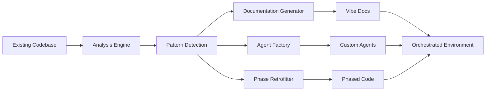

# Vibe Coding Retrofit System - Implementation Guide

## Executive Summary

The Vibe Coding Retrofit System transforms existing, chaotic codebases into well-organized, agent-orchestrated environments. This system provides:

1. **Deep Codebase Analysis** - Understanding existing architecture and patterns
2. **Automatic Documentation** - Generating missing Vibe Coding documents
3. **Custom Agent Generation** - Creating agents specific to your codebase
4. **Phase Retrofitting** - Converting code to Universal Format phases
5. **Incremental Adoption** - Gradual transformation without disruption

## Quick Start

### 1. Initial Retrofit
```bash
# Analyze and retrofit an existing project
/vibe-retrofit-existing /path/to/your/project

# Review the generated analysis
cat retrofit_analysis.md

# Approve and proceed
/vibe-approve-retrofit
```

### 2. Generate Custom Agents
```bash
# Generate all recommended agents
/vibe-generate-agents

# Or generate specific types
/vibe-generate-agents --pattern="api_endpoints"
/vibe-generate-agents --architecture="react"
```

### 3. Retrofit Phases
```bash
# Analyze phase structure
/vibe-retrofit-phases --analyze

# Start incremental retrofitting
/vibe-retrofit-phases --incremental
```

## System Architecture

### Core Components

```
Vibe Retrofit System
├── Analysis Engine
│   ├── Code Scanner
│   ├── Pattern Detector
│   ├── Dependency Mapper
│   └── Complexity Analyzer
│
├── Documentation Generator
│   ├── Context Builder
│   ├── Feature Extractor
│   ├── Status Reporter
│   └── Changelog Creator
│
├── Agent Factory
│   ├── Pattern-Based Generator
│   ├── Architecture Templates
│   ├── Workflow Automation
│   └── Relationship Mapper
│
├── Phase Retrofitter
│   ├── Code Segmentation
│   ├── Phase Assignment
│   ├── Migration Planner
│   └── Validation System
│
└── Integration Layer
    ├── Incremental Adoption
    ├── Compatibility Bridge
    ├── Testing Framework
    └── Progress Tracker
```

### Data Flow



## Detailed Workflows

### Workflow 1: Complete Retrofit

```yaml
complete_retrofit_workflow:
  1_analysis:
    duration: "30-60 minutes"
    steps:
      - Scan entire codebase
      - Detect patterns and architecture
      - Analyze dependencies
      - Measure complexity
    output:
      - retrofit_analysis.md
      - dependency_graph.svg
      - complexity_report.md
  
  2_documentation:
    duration: "15-30 minutes"
    steps:
      - Generate project_context.md
      - Create current_status.md
      - Extract features.md
      - Build changelog from git
    output:
      - Complete Vibe documentation set
  
  3_agent_generation:
    duration: "20-40 minutes"
    steps:
      - Generate architecture agents
      - Create pattern-based agents
      - Build workflow coordinators
      - Define relationships
    output:
      - Custom agent collection
      - Orchestration map
  
  4_phase_retrofitting:
    duration: "1-3 hours"
    steps:
      - Segment code by purpose
      - Assign to phases
      - Update imports
      - Validate functionality
    output:
      - Phase-organized codebase
      - Migration report
```

### Workflow 2: Incremental Adoption

```yaml
incremental_adoption_workflow:
  week_1:
    focus: "Documentation & Understanding"
    actions:
      - Run analysis
      - Generate documentation
      - Review architecture
    deliverables:
      - Full documentation set
      - Architecture understanding
  
  week_2:
    focus: "Agent Introduction"
    actions:
      - Generate basic agents
      - Test agent functionality
      - Train team on usage
    deliverables:
      - Working agents
      - Team familiarity
  
  week_3:
    focus: "Partial Phase Retrofit"
    actions:
      - Retrofit utilities (Phase 2)
      - Test thoroughly
      - Measure impact
    deliverables:
      - Foundation phase complete
      - Metrics baseline
  
  week_4_onwards:
    focus: "Progressive Enhancement"
    actions:
      - Add more agents
      - Retrofit additional phases
      - Optimize workflows
    deliverables:
      - Fully orchestrated environment
```

## Agent Generation Deep Dive

### Pattern Recognition

The system recognizes and generates agents for:

1. **Component Patterns**
   - React components → `react_component_orchestrator`
   - Vue components → `vue_component_manager`
   - Angular modules → `angular_module_coordinator`

2. **API Patterns**
   - REST endpoints → `api_endpoint_orchestrator`
   - GraphQL resolvers → `graphql_resolver_manager`
   - WebSocket handlers → `websocket_coordinator`

3. **Database Patterns**
   - Migrations → `database_migration_handler`
   - Models → `model_generator`
   - Queries → `query_optimizer`

4. **Workflow Patterns**
   - Feature development → `feature_workflow_coordinator`
   - Bug fixes → `bugfix_workflow_agent`
   - Deployments → `deployment_orchestrator`

### Agent Customization

```yaml
# .vibe-retrofit/agent-config.yaml
agent_customization:
  react_component_orchestrator:
    overrides:
      styling_system: "emotion"  # Override detected styling
      test_framework: "vitest"   # Override test framework
    
    additional_capabilities:
      - generate_storybook_stories
      - create_cypress_tests
    
    custom_templates:
      component_template: "./templates/component.tsx"
      test_template: "./templates/test.tsx"
  
  api_endpoint_orchestrator:
    overrides:
      response_format: "json:api"
      auth_method: "oauth2"
    
    exclude_patterns:
      - "/internal/*"
      - "/legacy/*"
```

## Phase Retrofitting Strategies

### Strategy Comparison

| Strategy | Best For | Pros | Cons |
|----------|----------|------|------|
| Preserve Structure | Minimal disruption | Easy adoption, low risk | Less clean organization |
| Full Restructure | Greenfield mindset | Clean phases, clear boundaries | Higher risk, more work |
| Hybrid Approach | Most projects | Balance of clean and safe | Requires careful planning |

### Phase Assignment Logic

```python
def assign_to_phase(file_path, file_content):
    # Phase 2: Foundation
    if any(pattern in file_path for pattern in [
        '/config/', '/setup/', '/utils/', '/helpers/'
    ]):
        return 'phase_2_foundation'
    
    # Phase 3: Core Logic
    if any(pattern in file_path for pattern in [
        '/models/', '/services/', '/business/', '/domain/'
    ]):
        return 'phase_3_core_logic'
    
    # Phase 4: Interface
    if any(pattern in file_path for pattern in [
        '/components/', '/views/', '/pages/', '/controllers/'
    ]):
        return 'phase_4_interface'
    
    # Phase 5: Integration
    if any(pattern in file_path for pattern in [
        '/integrations/', '/external/', '/third-party/'
    ]):
        return 'phase_5_integration'
    
    # Phase 6: Testing
    if any(pattern in file_path for pattern in [
        '.test.', '.spec.', '/tests/', '/__tests__/'
    ]):
        return 'phase_6_testing'
    
    # Analyze content if path doesn't match
    return analyze_content_for_phase(file_content)
```

## Success Metrics

### Immediate Metrics
- **Documentation Coverage**: 0% → 80%+
- **Automated Tasks**: Manual → Agent-handled
- **Code Organization**: Scattered → Phased
- **Pattern Consistency**: Variable → Standardized

### Long-term Metrics
- **Development Velocity**: 2x improvement
- **Bug Reduction**: 50% fewer bugs
- **Onboarding Time**: Days → Hours
- **Technical Debt**: High → Manageable

### ROI Calculation
```yaml
retrofit_roi:
  costs:
    initial_setup: "2-5 days"
    learning_curve: "1 week"
    migration_time: "1-2 weeks"
  
  benefits:
    weekly_time_saved: "10-20 hours"
    bug_reduction: "50%"
    onboarding_improvement: "75%"
    maintenance_reduction: "60%"
  
  breakeven: "3-4 weeks"
  annual_roi: "400-800%"
```

## Common Patterns & Solutions

### Pattern 1: Monolithic Application
```yaml
problem: "Large monolithic application with mixed concerns"
solution:
  - Use aggressive phase retrofitting
  - Generate module separation agents
  - Create gradual extraction plan
  
agents_generated:
  - monolith_decomposer
  - module_boundary_enforcer
  - dependency_tracker
```

### Pattern 2: Microservices Chaos
```yaml
problem: "Multiple microservices with inconsistent patterns"
solution:
  - Generate service-specific agents
  - Create cross-service coordinators
  - Standardize communication patterns

agents_generated:
  - service_orchestrator
  - api_gateway_manager
  - service_mesh_coordinator
```

### Pattern 3: Legacy Frontend
```yaml
problem: "jQuery/vanilla JS with no framework"
solution:
  - Create migration agents
  - Generate component wrappers
  - Plan incremental modernization

agents_generated:
  - legacy_modernizer
  - component_migrator
  - framework_adopter
```

## Troubleshooting

### Common Issues

1. **Analysis Takes Too Long**
   ```bash
   # Use focused analysis
   /vibe-retrofit-existing /path --focus=backend
   
   # Or analyze in sections
   /vibe-retrofit-existing /path/src/components
   ```

2. **Too Many Agents Generated**
   ```bash
   # Use interactive mode
   /vibe-generate-agents --interactive
   
   # Or generate by pattern
   /vibe-generate-agents --pattern="critical_only"
   ```

3. **Phase Retrofit Breaks Code**
   ```bash
   # Use incremental approach
   /vibe-retrofit-phases --incremental
   
   # Enable automatic rollback
   /vibe-retrofit-phases --auto-rollback
   ```

## Best Practices

### Do's
1. ✅ Start with analysis and documentation
2. ✅ Test thoroughly after each change
3. ✅ Use incremental adoption for large codebases
4. ✅ Customize agents to match your patterns
5. ✅ Involve the whole team in the process

### Don'ts
1. ❌ Don't retrofit everything at once
2. ❌ Don't skip validation steps
3. ❌ Don't ignore existing patterns
4. ❌ Don't over-engineer agent capabilities
5. ❌ Don't forget to update documentation

## Next Steps

1. **Run Initial Analysis**
   ```bash
   /vibe-retrofit-existing /your/project/path
   ```

2. **Review Generated Report**
   - Understand detected patterns
   - Check suggested agents
   - Review phase assignments

3. **Start Incremental Adoption**
   - Begin with documentation
   - Add basic agents
   - Retrofit foundation phase

4. **Iterate and Improve**
   - Gather team feedback
   - Customize agents
   - Expand coverage

5. **Share Success**
   - Document improvements
   - Train team members
   - Contribute patterns back

## Conclusion

The Vibe Coding Retrofit System transforms existing codebases into powerful, agent-orchestrated environments. By following this guide, you can:

- Understand your codebase deeply
- Generate comprehensive documentation
- Create custom agents for your patterns
- Organize code into clear phases
- Achieve the full power of Vibe Coding

Start your retrofit journey today and transform chaos into orchestrated productivity!