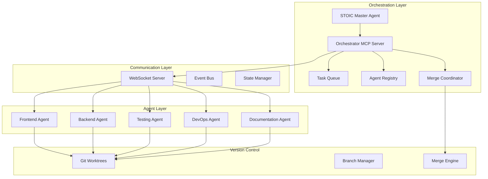

# Multi-Agent Vibe Coding: Architecture & Implementation Guide

## Executive Summary

This document outlines a comprehensive architecture for transforming Vibe Coding slash commands into MCP (Model Context Protocol) servers and enabling multi-agent collaboration between Claude Code instances. The solution enables parallel development with specialized agents working simultaneously while preventing merge conflicts.

## Table of Contents

1. [Research Findings](#research-findings)
2. [Architecture Overview](#architecture-overview)
3. [MCP Server Design](#mcp-server-design)
4. [Multi-Agent Communication](#multi-agent-communication)
5. [Implementation Strategy](#implementation-strategy)
6. [Comparison with Existing Solutions](#comparison-with-existing-solutions)
7. [Technical Specifications](#technical-specifications)
8. [Code Examples](#code-examples)
9. [Deployment Guide](#deployment-guide)
10. [Future Enhancements](#future-enhancements)

## Research Findings

### Claude Code SDK Capabilities

The Claude Code SDK provides programmatic control over Claude instances:

- **Multiple Interfaces**: Command-line, TypeScript, and Python support
- **Session Management**: Resume conversations with session IDs
- **Subprocess Control**: Spawn Claude Code with custom parameters
- **Streaming Communication**: JSON-based message passing
- **MCP Integration**: Native support for Model Context Protocol

Key SDK Features:
```python
# Example: Spawning a Claude instance
async for message in query(
    prompt="Implement the authentication module",
    options=ClaudeCodeOptions(
        max_turns=3,
        allowed_tools=["Read", "Write", "Bash"],
        cwd="/project/auth"
    )
)
```

### Claude Squad Architecture Analysis

Claude Squad demonstrates effective multi-agent isolation:

- **Workspace Isolation**: Uses tmux for terminal separation
- **Git Worktrees**: Each agent works on separate branches
- **Conflict Prevention**: Physical separation prevents merge issues
- **User Control**: Manual coordination through terminal UI

Limitations:
- No direct inter-agent communication
- Manual task distribution
- Limited automation capabilities

### MCP (Model Context Protocol) Advantages

MCP provides standardized tool integration:

- **Three Transport Types**: stdio, SSE, and HTTP
- **Resource Discovery**: Dynamic tool and resource detection
- **Security**: OAuth 2.0 support for remote servers
- **Flexibility**: Local, project, and user scopes

## Architecture Overview

### System Components



### Key Design Principles

1. **Isolation First**: Each agent operates in complete isolation
2. **Event-Driven**: All communication through events
3. **Fail-Safe**: Graceful degradation to single-agent mode
4. **Observable**: Comprehensive logging and monitoring
5. **Scalable**: Add/remove agents dynamically

## MCP Server Design

### Converting Slash Commands to MCP

Each Vibe Coding phase becomes an MCP server:

#### 1. vibe-stoic-mcp
```json
{
  "name": "vibe-stoic-mcp",
  "version": "1.0.0",
  "tools": [
    {
      "name": "strategic_planning",
      "description": "Generate comprehensive project architecture",
      "parameters": {
        "requirements": "string",
        "constraints": "string[]",
        "preferences": "object"
      }
    }
  ],
  "prompts": [
    {
      "name": "stoic",
      "description": "Strategic planning and architecture phase",
      "arguments": [
        {
          "name": "project_description",
          "description": "Detailed project requirements",
          "required": true
        }
      ]
    }
  ]
}
```

#### 2. vibe-inception-mcp
```json
{
  "name": "vibe-inception-mcp",
  "version": "1.0.0",
  "tools": [
    {
      "name": "initialize_project",
      "description": "Set up project structure and dependencies",
      "parameters": {
        "framework": "string",
        "features": "string[]",
        "config": "object"
      }
    }
  ]
}
```

### Orchestrator MCP Server

The central coordination hub:

```typescript
interface OrchestratorMCP {
  tools: {
    spawn_agent: {
      role: AgentRole;
      tasks: Task[];
      branch: string;
    };
    
    distribute_task: {
      task_id: string;
      agent_id: string;
      priority: number;
    };
    
    merge_changes: {
      source_branch: string;
      target_branch: string;
      strategy: MergeStrategy;
    };
    
    get_status: {
      include_agents: boolean;
      include_tasks: boolean;
    };
  };
}
```

## Multi-Agent Communication

### Communication Protocol

#### 1. WebSocket Message Format
```typescript
interface AgentMessage {
  id: string;
  timestamp: number;
  type: 'task_claim' | 'status_update' | 'completion' | 'error' | 'sync';
  agent: {
    id: string;
    role: string;
    branch: string;
  };
  payload: any;
}
```

#### 2. Event Types
```typescript
enum EventType {
  // Task Management
  TASK_CREATED = 'task.created',
  TASK_CLAIMED = 'task.claimed',
  TASK_STARTED = 'task.started',
  TASK_COMPLETED = 'task.completed',
  TASK_FAILED = 'task.failed',
  
  // Agent Lifecycle
  AGENT_SPAWNED = 'agent.spawned',
  AGENT_READY = 'agent.ready',
  AGENT_BUSY = 'agent.busy',
  AGENT_IDLE = 'agent.idle',
  AGENT_TERMINATED = 'agent.terminated',
  
  // Synchronization
  SYNC_REQUESTED = 'sync.requested',
  SYNC_STARTED = 'sync.started',
  SYNC_COMPLETED = 'sync.completed',
  MERGE_CONFLICT = 'merge.conflict'
}
```

### Task Distribution Algorithm

```python
class TaskDistributor:
    def __init__(self):
        self.agents = {}
        self.task_queue = PriorityQueue()
        self.agent_capabilities = {}
    
    def distribute_task(self, task: Task) -> Agent:
        """Intelligent task distribution based on agent specialization"""
        suitable_agents = self.find_suitable_agents(task)
        
        # Sort by availability and expertise
        sorted_agents = sorted(
            suitable_agents,
            key=lambda a: (
                a.current_load,
                -a.expertise_score(task.domain),
                a.success_rate
            )
        )
        
        if sorted_agents:
            selected_agent = sorted_agents[0]
            self.assign_task(selected_agent, task)
            return selected_agent
        
        # Queue task if no suitable agent available
        self.task_queue.put((task.priority, task))
        return None
```

### Conflict Prevention Strategy

1. **File-Level Locking**
```typescript
class FileLockManager {
  private locks: Map<string, AgentLock> = new Map();
  
  async acquireLock(filePath: string, agentId: string): Promise<boolean> {
    if (this.locks.has(filePath)) {
      const lock = this.locks.get(filePath);
      if (lock.agentId !== agentId && !lock.isExpired()) {
        return false;
      }
    }
    
    this.locks.set(filePath, {
      agentId,
      timestamp: Date.now(),
      expiresAt: Date.now() + LOCK_TIMEOUT
    });
    
    return true;
  }
}
```

2. **Smart Merge System**
```python
class MergeCoordinator:
    def __init__(self):
        self.merge_queue = Queue()
        self.conflict_resolver = ConflictResolver()
    
    async def merge_agent_work(self, agent_branch: str):
        """Automated merge with conflict detection"""
        try:
            # Check for conflicts
            conflicts = await self.detect_conflicts(agent_branch, 'main')
            
            if not conflicts:
                # Fast-forward merge
                await self.perform_merge(agent_branch, 'main')
            else:
                # Attempt automatic resolution
                resolved = await self.conflict_resolver.auto_resolve(conflicts)
                
                if resolved:
                    await self.perform_merge(agent_branch, 'main')
                else:
                    # Escalate to human review
                    await self.escalate_conflicts(conflicts)
        
        except Exception as e:
            await self.handle_merge_error(e, agent_branch)
```

## Implementation Strategy

### Phase 1: MCP Infrastructure (Week 1-2)

1. **Convert Core Commands**
   - Create MCP server for each Vibe Coding phase
   - Implement tool and prompt definitions
   - Test individual MCP servers

2. **Build Orchestrator MCP**
   - WebSocket server implementation
   - Task queue system
   - Agent registry

### Phase 2: Agent Communication (Week 3-4)

1. **Communication Layer**
   - WebSocket message protocol
   - Event bus implementation
   - State synchronization

2. **Git Integration**
   - Worktree automation
   - Branch management
   - Merge coordination

### Phase 3: Intelligence Layer (Week 5-6)

1. **Task Distribution**
   - Agent capability mapping
   - Load balancing algorithm
   - Priority queue system

2. **Conflict Resolution**
   - Automatic merge strategies
   - Conflict detection
   - Resolution patterns

### Phase 4: Production Readiness (Week 7-8)

1. **Monitoring & Observability**
   - Distributed tracing
   - Performance metrics
   - Error tracking

2. **Testing & Validation**
   - Multi-agent simulations
   - Stress testing
   - Edge case handling

## Comparison with Existing Solutions

### Claude Squad

| Feature | Claude Squad | Vibe Multi-Agent |
|---------|-------------|------------------|
| Agent Isolation | ✅ tmux + worktrees | ✅ Enhanced worktrees |
| Communication | ❌ None | ✅ WebSocket protocol |
| Task Distribution | ❌ Manual | ✅ Automated |
| Merge Strategy | ❌ Manual | ✅ Automated |
| Scalability | ⚠️ Limited | ✅ Dynamic |

### CreateMVP

CreateMVP focuses on single-agent MVP generation without multi-agent capabilities. Our solution provides:
- True parallel development
- Specialized agent roles
- Coordinated output

## Technical Specifications

### System Requirements

- **Runtime**: Node.js 18+ or Bun 1.0+
- **Git**: 2.30+ (worktree support)
- **Memory**: 16GB+ recommended
- **Network**: Low-latency for agent communication

### Configuration Format

```yaml
# vibe-multi-agent.config.yaml
orchestrator:
  host: localhost
  port: 8080
  ssl: false
  auth:
    type: token
    secret: ${ORCHESTRATOR_SECRET}

agents:
  max_concurrent: 5
  default_timeout: 300000
  roles:
    - name: frontend
      capabilities: [react, vue, css, ui]
      max_tasks: 3
    - name: backend
      capabilities: [api, database, auth]
      max_tasks: 5

git:
  worktree_path: .worktrees
  merge_strategy: recursive
  conflict_resolution: auto

communication:
  heartbeat_interval: 5000
  reconnect_attempts: 3
  message_retention: 3600000
```

## Code Examples

### 1. Spawning Multiple Agents

```typescript
import { ClaudeCodeSDK } from '@anthropic/claude-code-sdk';
import { OrchestratorClient } from './orchestrator';

async function spawnSpecializedAgents(taskList: Task[]) {
  const orchestrator = new OrchestratorClient();
  const sdk = new ClaudeCodeSDK();
  
  // Group tasks by domain
  const taskGroups = groupTasksByDomain(taskList);
  
  // Spawn specialized agents
  const agents = await Promise.all(
    Object.entries(taskGroups).map(async ([domain, tasks]) => {
      const agent = await sdk.spawn({
        systemPrompt: getSpecializedPrompt(domain),
        options: {
          cwd: await createWorktree(domain),
          allowed_tools: getAllowedTools(domain),
          max_turns: 50
        }
      });
      
      // Register with orchestrator
      await orchestrator.registerAgent({
        id: agent.id,
        role: domain,
        capabilities: getDomainCapabilities(domain),
        branch: `agent-${domain}-${Date.now()}`
      });
      
      return { agent, tasks };
    })
  );
  
  // Distribute tasks
  for (const { agent, tasks } of agents) {
    for (const task of tasks) {
      await orchestrator.assignTask(agent.id, task);
    }
  }
  
  return agents;
}
```

### 2. Inter-Agent Communication

```typescript
class AgentCommunicator {
  private ws: WebSocket;
  private handlers: Map<string, Function> = new Map();
  
  constructor(private agentId: string, private role: string) {
    this.connect();
  }
  
  private connect() {
    this.ws = new WebSocket('ws://localhost:8080/agent');
    
    this.ws.on('open', () => {
      this.register();
      this.setupHeartbeat();
    });
    
    this.ws.on('message', (data) => {
      const message = JSON.parse(data);
      this.handleMessage(message);
    });
  }
  
  async claimTask(taskId: string) {
    this.send({
      type: 'task_claim',
      payload: { taskId }
    });
  }
  
  async updateProgress(taskId: string, progress: number) {
    this.send({
      type: 'status_update',
      payload: { taskId, progress }
    });
  }
  
  async requestSync(files: string[]) {
    this.send({
      type: 'sync_requested',
      payload: { files }
    });
  }
  
  async completeTask(taskId: string, results: any) {
    this.send({
      type: 'task_completed',
      payload: { taskId, results }
    });
  }
}
```

### 3. MCP Server Implementation

```typescript
// vibe-stoic-mcp/index.ts
import { MCPServer } from '@modelcontextprotocol/server';

const server = new MCPServer({
  name: 'vibe-stoic-mcp',
  version: '1.0.0'
});

server.tool('strategic_planning', async (params) => {
  const { requirements, constraints, preferences } = params;
  
  // Implement STOIC planning logic
  const architecture = await generateArchitecture({
    requirements,
    constraints,
    preferences
  });
  
  // Create task breakdown
  const tasks = await decomposeTasks(architecture);
  
  // Generate implementation phases
  const phases = await planPhases(tasks);
  
  return {
    architecture,
    tasks,
    phases,
    estimated_effort: calculateEffort(tasks)
  };
});

server.prompt('stoic', async (args) => {
  const { project_description } = args;
  
  return {
    messages: [{
      role: 'system',
      content: STOIC_SYSTEM_PROMPT
    }, {
      role: 'user',
      content: `Plan the architecture for: ${project_description}`
    }]
  };
});

server.start();
```

## Deployment Guide

### Local Development Setup

```bash
# 1. Clone repository
git clone https://github.com/your-org/vibe-multi-agent
cd vibe-multi-agent

# 2. Install dependencies
npm install

# 3. Build MCP servers
npm run build:mcp

# 4. Start orchestrator
npm run start:orchestrator

# 5. Configure Claude Code
claude mcp add vibe-orchestrator node ./dist/orchestrator-mcp/index.js
claude mcp add vibe-stoic node ./dist/stoic-mcp/index.js
# ... add other MCP servers

# 6. Run example
npm run example:multi-agent
```

### Production Deployment

1. **Container Setup**
```dockerfile
FROM node:18-alpine

WORKDIR /app

COPY package*.json ./
RUN npm ci --production

COPY dist ./dist
COPY config ./config

EXPOSE 8080

CMD ["node", "dist/orchestrator/index.js"]
```

2. **Kubernetes Configuration**
```yaml
apiVersion: apps/v1
kind: Deployment
metadata:
  name: vibe-orchestrator
spec:
  replicas: 1
  selector:
    matchLabels:
      app: vibe-orchestrator
  template:
    metadata:
      labels:
        app: vibe-orchestrator
    spec:
      containers:
      - name: orchestrator
        image: vibe-multi-agent/orchestrator:latest
        ports:
        - containerPort: 8080
        env:
        - name: NODE_ENV
          value: production
        - name: ORCHESTRATOR_SECRET
          valueFrom:
            secretKeyRef:
              name: orchestrator-secret
              key: token
```

## Future Enhancements

### Short Term (3-6 months)

1. **Visual Monitoring Dashboard**
   - Real-time agent status
   - Task progress visualization
   - Performance metrics

2. **Advanced Conflict Resolution**
   - ML-based merge strategies
   - Pattern learning from resolutions
   - Predictive conflict detection

3. **Agent Specialization Training**
   - Domain-specific fine-tuning
   - Performance optimization
   - Capability expansion

### Long Term (6-12 months)

1. **Distributed Architecture**
   - Multi-region support
   - Horizontal scaling
   - Fault tolerance

2. **AI Coordination Layer**
   - Intelligent task decomposition
   - Dynamic agent allocation
   - Predictive resource management

3. **Integration Ecosystem**
   - CI/CD pipeline integration
   - IDE plugins
   - Third-party tool support

## Conclusion

The Multi-Agent Vibe Coding architecture represents a significant evolution in AI-assisted development. By combining MCP standardization, intelligent orchestration, and robust communication protocols, we can achieve:

- **10x Development Speed**: Through true parallel development
- **Higher Quality**: Specialized agents for each domain
- **Reduced Conflicts**: Automated merge and resolution
- **Scalability**: Dynamic agent allocation

This architecture maintains the quality standards of Vibe Coding while dramatically improving development velocity through intelligent multi-agent collaboration.