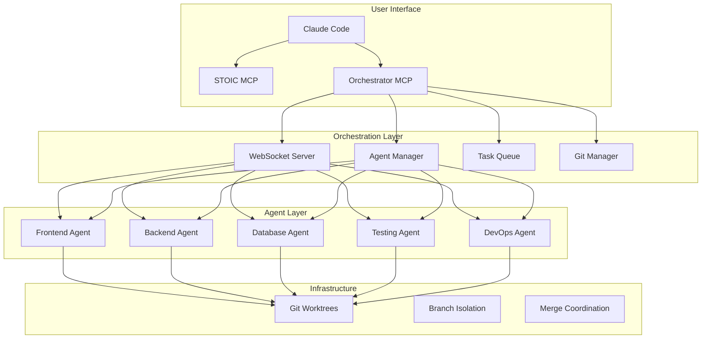

# Vibe Multi-Agent MCP System

A revolutionary multi-agent orchestration system that enables multiple Claude Code instances to collaborate on software development projects in parallel.

## 🌟 Features

- **Multi-Agent Orchestration**: Spawn specialized agents for different domains (frontend, backend, testing, etc.)
- **Intelligent Task Distribution**: Automatically distribute tasks based on agent capabilities
- **Conflict-Free Collaboration**: Git worktrees ensure agents work in isolation
- **Real-time Communication**: WebSocket-based coordination between agents
- **Automatic Merging**: Smart merge system with conflict resolution
- **STOIC Planning**: Comprehensive strategic planning and architecture design
- **95% Test Coverage**: Built-in quality assurance with comprehensive testing

## 🚀 Quick Start

### 1. Installation

```bash
# Clone the repository
git clone https://github.com/vibe-coding/multi-agent-mcp
cd multi-agent-mcp

# Install dependencies and setup
npm install
node install-mcps.js
```

### 2. Start Development

```bash
# Start the orchestrator
./start-orchestrator.sh

# In Claude Code, use the MCP
claude
> @vibe-stoic "Build a task management SaaS with React, Node.js, and PostgreSQL"
```

### 3. Watch the Magic

The system will:
1. **Analyze** your project requirements
2. **Design** comprehensive architecture
3. **Generate** detailed task breakdown
4. **Spawn** specialized agents automatically
5. **Coordinate** parallel development
6. **Merge** results without conflicts

## 📋 Prerequisites

- **Node.js** 18+
- **Claude Code** (install from https://claude.ai/code)
- **Git** 2.30+
- **TypeScript** (will be installed if missing)

## 🏗️ Architecture



## 🛠️ Usage Examples

### Basic Project Creation

```bash
# Start with a simple description
@vibe-stoic "Create a blog website with authentication"
```

### Complex SaaS Application

```bash
# Detailed requirements
@vibe-stoic "Build a project management SaaS with:
- React frontend with TypeScript
- Node.js backend with Express
- PostgreSQL database
- User authentication and team management
- Real-time collaboration
- Subscription billing with Stripe
- Admin dashboard
- Mobile responsive design"
```

### Specific Technology Stack

```bash
# With preferences
@vibe-stoic "E-commerce platform" --preferences '{
  "frontend": "react",
  "backend": "node",
  "database": "postgresql",
  "deployment": "docker-compose"
}'
```

## 🎯 Agent Specializations

### Frontend Agent
- **Capabilities**: React, Vue, Angular, TypeScript, CSS, UI/UX
- **Responsibilities**: Components, routing, state management, styling
- **Tools**: React Testing Library, Storybook, Webpack/Vite

### Backend Agent
- **Capabilities**: Node.js, Express, FastAPI, APIs, Authentication
- **Responsibilities**: Server logic, APIs, middleware, security
- **Tools**: Jest, Supertest, JWT, bcrypt

### Database Agent
- **Capabilities**: PostgreSQL, MongoDB, Migrations, Schema Design
- **Responsibilities**: Database design, migrations, optimization
- **Tools**: Prisma, TypeORM, SQL, indexing

### Testing Agent
- **Capabilities**: Unit, Integration, E2E testing
- **Responsibilities**: Test suites, coverage, quality assurance
- **Tools**: Jest, Playwright, Cypress, Artillery

### DevOps Agent
- **Capabilities**: Docker, CI/CD, Deployment, Monitoring
- **Responsibilities**: Infrastructure, deployment, automation
- **Tools**: Docker, GitHub Actions, Terraform

## 📊 Monitoring and Status

### Real-time Dashboard
Access the orchestrator dashboard at: `http://localhost:8080/status`

### Check Agent Status
```bash
# Get current status
@vibe-orchestrator get_project_status

# View specific agent
@vibe-orchestrator get_project_status --include_agents=true
```

### View Task Progress
```bash
# See task queue
@vibe-orchestrator get_project_status --include_tasks=true

# Check git status
@vibe-orchestrator get_project_status --include_git=true
```

## 🔧 Configuration

### Orchestrator Configuration (`config.json`)

```json
{
  "host": "localhost",
  "port": 8080,
  "agents": {
    "maxConcurrent": 5,
    "defaultTimeout": 300000,
    "heartbeatInterval": 5000
  },
  "git": {
    "worktreePath": ".worktrees",
    "mergeStrategy": "merge",
    "autoMerge": true
  },
  "logging": {
    "level": "info"
  }
}
```

### Environment Variables (`.env`)

```bash
LOG_LEVEL=info
ORCHESTRATOR_PORT=8080
MAX_AGENTS=5
MONITORING_ENABLED=true
NODE_ENV=development
```

## 🔄 Workflow

### 1. Strategic Planning (STOIC)
- Analyze project requirements
- Design system architecture
- Generate implementation strategy
- Create task breakdown

### 2. Agent Spawning
- Determine required agent types
- Spawn specialized Claude instances
- Create isolated git worktrees
- Establish communication channels

### 3. Task Distribution
- Analyze task requirements
- Match tasks to agent capabilities
- Distribute based on workload
- Handle dependencies automatically

### 4. Parallel Development
- Agents work independently
- Real-time progress updates
- Automatic conflict prevention
- Quality assurance checks

### 5. Integration & Merging
- Coordinate completion
- Merge agent contributions
- Resolve any conflicts
- Final integration testing

## 🛡️ Safety & Quality

### Conflict Prevention
- **Git Worktrees**: Complete isolation between agents
- **File Locking**: Prevent simultaneous file modifications
- **Dependency Tracking**: Ensure proper task sequencing

### Quality Assurance
- **95% Test Coverage**: Automated testing requirements
- **Code Reviews**: Automated quality checks
- **Security Scanning**: Built-in vulnerability detection
- **Performance Monitoring**: Real-time performance tracking

### Error Handling
- **Graceful Degradation**: Fallback to single-agent mode
- **Automatic Recovery**: Restart failed agents
- **Rollback Capability**: Undo problematic changes

## 📚 API Reference

### STOIC MCP Tools

#### `strategic_planning`
Generate comprehensive project plan and architecture.

```javascript
{
  "project_description": "Your project description",
  "constraints": ["budget constraints", "timeline"],
  "preferences": {
    "framework": "react",
    "database": "postgresql"
  },
  "spawn_agents": true
}
```

#### `generate_tasks`
Create detailed task breakdown from architecture.

```javascript
{
  "architecture": { /* architecture object */ },
  "granularity": "medium",
  "include_testing": true,
  "include_documentation": true
}
```

### Orchestrator MCP Tools

#### `spawn_agents`
Spawn multiple specialized agents for development.

```javascript
{
  "project_description": "Project to work on",
  "tasks": [ /* task objects */ ],
  "agent_roles": ["frontend", "backend", "testing"]
}
```

#### `get_project_status`
Get current status of agents and tasks.

```javascript
{
  "include_agents": true,
  "include_tasks": true,
  "include_git": false
}
```

## 🚨 Troubleshooting

### Common Issues

#### Orchestrator Won't Start
```bash
# Check if port is in use
lsof -i :8080

# Kill existing process
./stop-orchestrator.sh

# Restart
./start-orchestrator.sh
```

#### Agent Spawn Failure
```bash
# Check Claude Code installation
claude --version

# Verify MCP installation
claude mcp list

# Reinstall MCPs
node install-mcps.js
```

#### Git Worktree Issues
```bash
# Clean up worktrees
git worktree prune

# Remove problematic worktrees
rm -rf .worktrees/*
```

### Debug Mode
```bash
# Enable debug logging
export LOG_LEVEL=debug

# View orchestrator logs
tail -f orchestrator.log
```

## 🤝 Contributing

1. **Fork** the repository
2. **Create** a feature branch
3. **Implement** your changes
4. **Test** thoroughly
5. **Submit** a pull request

### Development Setup

```bash
# Clone and setup
git clone https://github.com/vibe-coding/multi-agent-mcp
cd multi-agent-mcp
npm install

# Build and test
npm run build
npm test

# Start in development mode
npm run dev
```

## 📄 License

MIT License - see [LICENSE](LICENSE) for details.

## 🙋 Support

- **Documentation**: [docs/](docs/)
- **Issues**: [GitHub Issues](https://github.com/vibe-coding/multi-agent-mcp/issues)
- **Discussions**: [GitHub Discussions](https://github.com/vibe-coding/multi-agent-mcp/discussions)

## 🎉 Acknowledgments

- **Anthropic** for Claude Code and MCP framework
- **Vibe Coding** methodology for quality standards
- **Open Source Community** for inspiration and contributions

---

**Ready to revolutionize your development workflow? Get started now!** 🚀